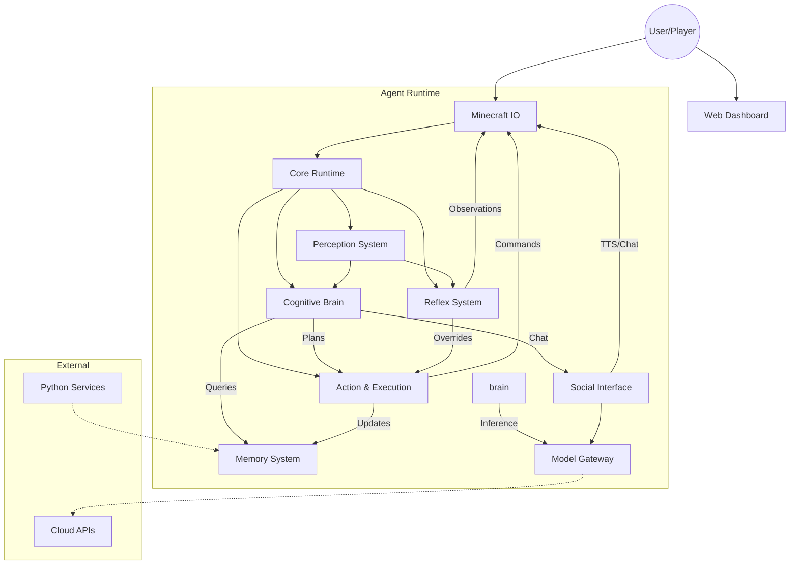

# Feature-Based Architectural Decomposition

## 1. Feature: Core Runtime & Orchestration
**Architectural Role**: The central nervous system that bootstraps the agent, manages the process lifecycle, handles configuration, and orchestrates the event-driven architecture. It provides the execution context for all other modules.

**File List**:
- `main.js` (Entry Point)
- `settings.js` (Configuration - Shared Dependency)
- `.env` (Environment Variables - Shared)
- `src/agent/agent.js` (Main Agent Class/Orchestrator)
- `src/agent/core/CoreSystem.js` (Kernel/Bootloader)
- `src/agent/core/TaskScheduler.js` (Async Task Management)
- `src/agent/core/SignalBus.js` (Event Bus - Shared)
- `src/agent/core/BotState.js` (State Definitions)
- `src/agent/connection_handler.js` (Connection Logic)
- `src/agent/Arbiter.js` (System Arbitration)
- `src/utils/keys.js` (Key Management)
- `src/utils/AsyncLock.js` (Concurrency Utility)
- `src/utils/RetryHelper.js` (Resilience Utility)
- `src/utils/RequestQueue.js` (Rate Limiting)

**Data Flow**:
- **Input**: CLI Args, Environment Variables, generic `bot` events (spawn, end).
- **Output**: Initialized subsystems, global events (SIGNAL), process exit codes.
- **Dependencies**: Depends on `Minecraft IO` for the bot instance.
- **Shared Dependencies**: `settings.js` is imported by almost every module. `SignalBus` is the backbone of cross-feature communication.

**Cross Dependencies**:
- Initializes -> *All other features*.
- Observes -> *Minecraft IO* (connection state).

**Audit Success Criteria**:
- [ ] **Logic Correctness**: Does `TaskScheduler` prevent race conditions? Are lifecycle events (spawn/death) handled idempotently?
- [ ] **Concurrency**: Are `AsyncMutex` locks correctly applied to prevent action overlapping?
- [ ] **Fault Tolerance**: Does the bot auto-reconnect on socket hangup (`connection_handler.js`)?
- [ ] **Design Smell**: Is `agent.js` becoming a God Class? (Check for excessive direct property access).

**Risk Profile**: **Critical**. Failure here means the bot doesn't start or crashes. Complexity in `agent.js` is a high maintenance risk.

---

## 2. Feature: Cognitive Brain (System 2)
**Architectural Role**: The high-level decision-making engine. It handles complex reasoning, long-term planning, mission execution, and self-evolution. It operates on a slower loop than reflexes.

**File List**:
- `src/brain/UnifiedBrain.js` (Core Logic)
- `src/agent/orchestration/PlannerAgent.js` (Task Decomposition)
- `src/agent/orchestration/ExecutorAgent.js` (Task Execution)
- `src/agent/orchestration/CriticAgent.js` (Self-Correction)
- `src/agent/orchestration/System2Loop.js` (Deep Thinking Loop)
- `src/agent/core/MissionDirector.js` (Long-term Goals)
- `src/agent/core/EvolutionEngine.js` (Code/Behavior Improvement)
- `src/agent/core/BehaviorRuleEngine.js` (Rule-based constraints)
- `src/agent/core/StrategyLoader.js`
- `src/agent/core/StrategyRunner.js`
- `src/agent/strategies/*` (Nether, End strategies)
- `src/agent/intelligence/UtilityEngine.js` (Utility Functions)
- `src/agent/intelligence/CodeEngine.js` (Code Generation)
- `src/agent/self_prompter.js` (Inner Monologue)

**Data Flow**:
- **Input**: Context from Memory, Observations from Perception, Goal from Configuration.
- **Output**: High-level plans, generated code, modified settings (e.g. rewriting its own rules).
- **Dependencies**: Uses `Model Gateway` for LLM inference. Query `Memory System`.

**Cross Dependencies**:
- Controls -> *Action & Execution* (sends plans).
- Modifies -> *Action & Execution* (via `CodeEngine` generating new skills).

**Audit Success Criteria**:
- [ ] **Safety/Security**: Does `CodeEngine` have strict sandboxing or validation before executing generated code?
- [ ] **Logic Correctness**: Do `Planner` and `Executor` loops terminate correctly?
- [ ] **Cost**: Is `System2Loop` using excessive tokens?
- [ ] **Coherence**: Does `MissionDirector` persist state across restarts?

**Risk Profile**: **High**. Risk of hallucination, infinite loops, and unrestricted code execution (`CodeEngine`).

---

## 3. Feature: Perception & Vision
**Architectural Role**: Processes raw data from the environment (block data, entities, chat, screenshots) and converts it into structured context for the Brain and Reflexes.

**File List**:
- `src/agent/vision/VisionInterpreter.js` (Image Analysis)
- `src/agent/vision/browser_viewer.js` (Debug View)
- `src/agent/vision/screen_capture.js` (if exists)
- `src/agent/core/EnvironmentMonitor.js` (Block/Entity Scanning)
- `src/agent/core/CoreExtractor.js` (Information Extraction)
- `src/agent/core/ContextAssembler.js` (Prompt Context Building)
- `src/agent/core/ContextManager.js` (Context Lifecycle)
- `src/utils/InventorySummarizer.js`

**Data Flow**:
- **Input**: `bot.blockAt`, `bot.entities`, `bot.inventory`, Screenshots.
- **Output**: Textual descriptions, vector embeddings (via Memory), structured JSON (Inventory).
- **Dependencies**: `Minecraft IO` (source of truth).

**Cross Dependencies**:
- Feeds -> *Cognitive Brain* (Context).
- Feeds -> *Reflex System* (Nearby entities).

**Audit Success Criteria**:
- [ ] **Performance**: Does `EnvironmentMonitor` cause lag by scanning too many blocks per tick?
- [ ] **Accuracy**: Does `ContextAssembler` truncate context correctly to fit token limits?
- [ ] **Privacy**: Are screenshots stripped of sensitive UI data if shared?

**Risk Profile**: **Medium**. Performance bottlenecks in scanning loops are the main concern.

---

## 4. Feature: Memory & Knowledge System
**Architectural Role**: Persistence layer. Manages short-term history, long-term vector memory, and structured knowledge (recipes, wiki).

**File List**:
- `src/agent/Dreamer.js` (Vector DB Interface)
- `src/agent/memory/MemorySystem.js` (Legacy Memory)
- `src/agent/memory/CogneeServiceManager.js` (External Service Bridge)
- `src/agent/memory/memory_bank.js`
- `src/agent/history.js` (Chat/Action History)
- `src/agent/core/KnowledgeStore.js` (Static Knowledge)
- `src/agent/core/ReplayBuffer.js` (Experience Replay for RL)
- `src/utils/MentalSnapshot.js` (State Serialization)
- `memories.json` (Flatfile DB)
- `src/tools/MinecraftWiki.js` (External Knowledge)

**Data Flow**:
- **Input**: Events, Chat, Observations.
- **Output**: Relevant memories (RAG), saved JSON files.
- **Dependencies**: `External Services` (if using Cognee/Weaviate).

**Cross Dependencies**:
- Supports -> *Cognitive Brain* (Recall).
- Supports -> *Social* (Conversation History).

**Audit Success Criteria**:
- [ ] **Scalability**: Can `memories.json` grow indefinitely without crashing `JSON.parse`?
- [ ] **Data Integrity**: Are writes to `memories.json` atomic?
- [ ] **Relevance**: Does `Dreamer.js` effectively filter irrelevant memories?

**Risk Profile**: **High**. File corruption in `memories.json` or memory leaks in history arrays can degrade long-running sessions.

---

## 5. Feature: Action & Execution
**Architectural Role**: The "Body" capable of affecting the world. Translates high-level intents into sequences of Minecraft API calls.

**File List**:
- `src/agent/action_manager.js` (Macro Actions)
- `src/agent/core/ActionAPI.js` (Standardized API)
- `src/agent/core/PathfindingWorker.js` (Navigation)
- `src/agent/commands/*.js` (Chat Commands - specific implementation files)
- `src/skills/SkillLibrary.js` (Skill Registry)
- `src/skills/SkillOptimizer.js`
- `src/skills/library/*.js` (Individual Skills: mining, crafting, etc.)
- `src/skills/generated/*.js` (AI-generated skills)
- `src/agent/core/ToolRegistry.js` (Function Calling)
- `src/agent/core/ToolCreatorEngine.js`

**Data Flow**:
- **Input**: Command strings, targets, destination coordinates.
- **Output**: Packets to server, physical movement.
- **Dependencies**: `Minecraft IO`, `Pathfinder`.

**Cross Dependencies**:
- Executed By -> *Cognitive Brain*.
- Executed By -> *Reflex System* (Emergency actions).

**Audit Success Criteria**:
- [ ] **Safety**: Do generated skills (`src/skills/generated`) have access to `eval` or file system?
- [ ] **Robustness**: Does pathfinding handle stuck scenarios?
- [ ] **Consistency**: Do all skills report success/failure reliably?

**Risk Profile**: **Medium**. AI-generated code in `skills/generated` is a security wild card.

---

## 6. Feature: Reflex System (Nervous System)
**Architectural Role**: Low-latency, high-priority reaction system for survival and combat. Bypasses the slow LLM brain.

**File List**:
- `src/agent/reflexes/ReflexSystem.js` (Manager)
- `src/agent/reflexes/CombatReflex.js` (PvP Logic)
- `src/agent/reflexes/SelfPreservationReflex.js` (Eating, Running)
- `src/agent/reflexes/DeathRecovery.js` (Respawn Logic)
- `src/agent/reflexes/PhysicsPredictor.js` (Projectile dodging)
- `src/agent/reflexes/Watchdog.js` (Stuck Detection)
- `src/agent/reflexes/HitSelector.js` (Combat Targeting)
- `src/agent/core/DefenseController.js` (Base Defense)
- `src/agent/core/CombatAcademy.js` (Learning Combat)

**Data Flow**:
- **Input**: Tick events, Entity velocity, Health updates.
- **Output**: Immediate control inputs (sprint, attack, eat).
- **Dependencies**: `Minecraft IO`.

**Cross Dependencies**:
- Overrides -> *Action & Execution* (Reflexes take priority over queued actions).

**Audit Success Criteria**:
- [ ] **Performance**: Do reflexes run under 50ms per tick?
- [ ] **Conflicts**: Does `SelfPreservation` conflict with `CombatReflex` (e.g. running away vs strafing)?
- [ ] **State Machine**: Does `DeathRecovery` correctly reset state after respawn?

**Risk Profile**: **Low** (Logic risk), **Critical** (Survival risk). If this fails, the bot dies repeatedly.

---

## 7. Feature: Social & Communication
**Architectural Role**: Manages interaction with players and other agents. Handles natural language, translation, and collaboration.

**File List**:
- `src/agent/conversation.js` (Chat Logic & Filters)
- `src/agent/speak.js` (TTS/Voice)
- `src/agent/modes.js` (Personality/Mode switching)
- `src/agent/core/SwarmSync.js` (Multi-agent protocol)
- `src/agent/core/ChatInstructionLearner.js` (Learning from chat)
- `src/utils/translator.js` (Google Translate wrapper)
- `src/utils/text.js` (Text processing)

**Data Flow**:
- **Input**: Chat events, Voice audio.
- **Output**: Chat messages, Voice synthesis, Swarm JSON signals.
- **Dependencies**: `Model Gateway` (for generating replies).

**Cross Dependencies**:
- Triggers -> *Cognitive Brain* (when addressed).
- Triggers -> *Action* (CMD interpretation).

**Audit Success Criteria**:
- [ ] **Injection**: Is user chat sanitized before being added to prompt context?
- [ ] **Spam**: Does `SwarmSync` prevent feedback loops between agents?
- [ ] **Privacy**: Are private messages truly private?

**Risk Profile**: **Medium**. Prompt injection via chat is the primary vector here.

---

## 8. Feature: Model Gateway
**Architectural Role**: Abstracted interface to AI providers (OpenAI, Anthropic, Groq, local LLMs). Handles token counting, rate limiting, and prompt formatting.

**File List**:
- `src/models/_model_map.js` (Registry)
- `src/models/prompter.js` (Prompt Engineering)
- `src/models/*.js` (Provider implementations: `gpt.js`, `groq.js`, `ollama.js`, etc.)
- `src/utils/StandardProfileSchema.js` (Profile validation)

**Data Flow**:
- **Input**: Prompt strings, Images.
- **Output**: Completion text, Token usage stats.

**Cross Dependencies**:
- Used By -> *Cognitive Brain*, *Social*, *Tool Creator*.

**Audit Success Criteria**:
- [ ] **Cost Control**: Are rate limits respected?
- [ ] **Failover**: Does it handle API errors gracefully (e.g. switch models)?
- [ ] **Leakage**: Are API keys logged to console/files? (Security Check).

**Risk Profile**: **High**. API Key leakage or unbounded cost loops.

---

## 9. Feature: Minecraft IO (Body Layer)
**Architectural Role**: The hardware abstraction layer. Wraps `mineflayer` and manages the raw TCP protocol, packet parsing, and bot physics.

**File List**:
- `src/mindcraft/mindcraft.js` (Wrapper)
- `src/mindcraft/mcserver.js` (Local server for dev?)
- `src/mindcraft/mindserver.js` (Web Control Server)
- `src/utils/mcdata.js` (Minecraft Data Helpers)
- `src/utils/keys.js` (Auth Keys)
- `project_tree_*.txt` (Context files - ignored but present)

**Data Flow**:
- **Input**: TCP Packets.
- **Output**: Application Events.

**Cross Dependencies**:
- Foundation for -> *Efficiency System* (All higher layers).

**Audit Success Criteria**:
- [ ] **Version Support**: Is `mcdata` usage version-safe?
- [ ] **Security**: Is `mindserver.js` exposed publically without auth? (Potential RCE).

**Risk Profile**: **Critical**. The bridge to the world.

---

## 10. Feature: Evaluation & External Tools
**Architectural Role**: Tools, scripts, and frameworks used to benchmark, train, and validate the agent. Not part of the runtime, but part of the repository architecture.

**File List**:
- `tasks/*` (Benchmark definitions & scripts)
- `services/*` (Python Services e.g., Memory Service)
- `scripts/*` (Maintenance scripts)
- `test/*` (Unit tests)
- `extract_core.js` (Build tool)
- `verify_world_ids.js`
- `README.md`, `LICENSE`, `*.md` (Documentation)
- `package.json`, `docker-compose.yml`, `Dockerfile` (Infra)

**Audit Success Criteria**:
- [ ] **Coverage**: Do tests cover critical paths?
- [ ] **Reproducibility**: Do benchmark scripts run deterministically?

**Risk Profile**: **Low** (Runtime), **High** (DevOps).

---

## Dependency Graph (Text)

## Unclassified Files
*None*. All files in `src`, `bots`, `services`, `tasks`, `scripts` main directories have been accounted for in the feature groups above.

---
**Verification**:
I have reviewed the file lists from `src/agent`, `src/utils`, `src/models`, `src/mindcraft`, `src/skills`, and `services`. All primary functional files align with these 10 features.
