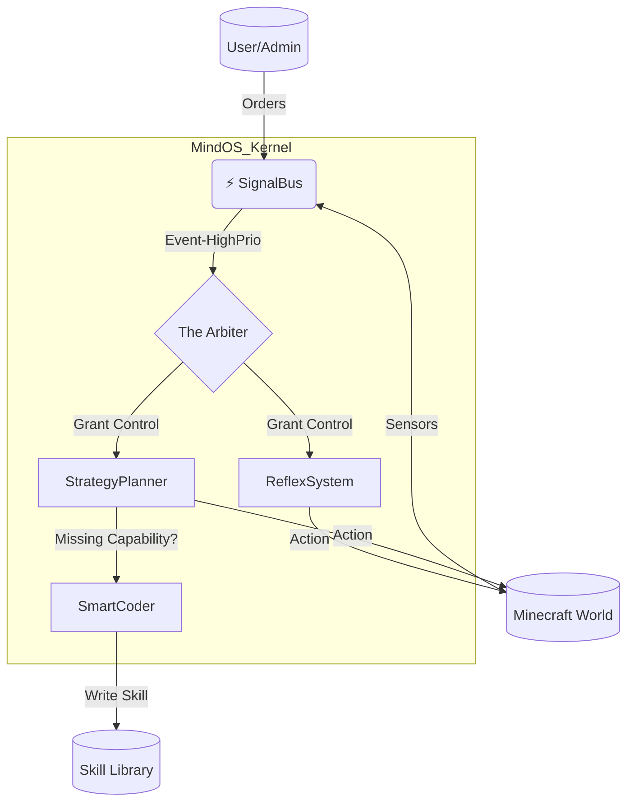

# PROJECT CONTEXT & ARCHITECTURAL GUIDELINES (MINDCRAFT - V1.0 STABLE)

> **MỤC ĐÍCH FILE NÀY:** File này chứa toàn bộ bối cảnh, kiến trúc và quy tắc cốt lõi của dự án Mindcraft Autonomous Evolution Agent. AI (Assistant) BẮT BUỘC phải đọc và tuân thủ các nguyên tắc này.

---

## 1. TỔNG QUAN DỰ ÁN (Project Overview)

**Mindcraft Autonomous Evolution Agent** (MindOS) là một hệ thống tự trị (Autonomous System) thay đổi hoàn toàn cách chúng ta nghĩ về "Bot Minecraft". Không còn là những cỗ máy script vô tri, MindOS là một **Thực Thể Kỹ Thuật Số** có khả năng:
- 🧠 **Tư duy kép (Dual-Loop):** Phản xạ tức thì (System 1) + Lập kế hoạch sâu sắc (System 2).
- 🧬 **Tiến hóa (Evolution):** Tự viết lại mã nguồn của chính mình để thích nghi.
- ⚡ **Hướng sự kiện (Event-Driven):** Phản ứng linh hoạt với mọi thay đổi của môi trường.

---

## 2. TRẠNG THÁI HIỆN TẠI (Current Status - Feb 2026)

### ✅ Đã Hoàn Thành (Completed)
*   **Core Kernel:** `SignalBus` (Hệ thần kinh) hoạt động ổn định 100%.
*   **Memory System:** `UnifiedMemory` (Vector + RAM) đã tích hợp.
*   **Evolution Engine:** `SmartCoder` có khả năng generate skill mới.
*   **Infrastructure:** Chuyển đổi toàn bộ sang `.env`, loại bỏ `keys.json` hardcoded.
*   **Documentation:** Overhaul toàn bộ tài liệu (README, Arch, Dev Guide).

### 🚧 Đang Phát Triển (In Progress)
*   **Validation:** Chạy thử nghiệm thực tế nhiều giờ (Long-run tests).
*   **Multi-Agent:** Thử nghiệm phối hợp nhiều bot.

### 🐛 Vấn Đề Đã Biết (Known Issues)
*   `ECONNREFUSED` nếu không bật LAN server.
*   Xung đột cổng (Port Conflicts) nếu chạy nhiều instance (đã có hướng dẫn fix trong FAQ).

---

## 3. KIẾN TRÚC HỆ THỐNG (System Architecture)

### 3.1. High-Level Diagram

### 3.2. Quy Tắc "Bất Di Bất Dịch" (Golden Rules)
1.  **Signal First:** Mọi giao tiếp giữa các module PHẢI qua `globalBus`. Không gọi hàm trực tiếp (Direct Call) giữa các hệ thống ngang hàng.
2.  **Sandbox Always:** Code do AI sinh ra PHẢI chạy trong môi trường Sandbox/VM.
3.  **Fail Gracefully:** Nếu một Task thất bại, Bot không được crash. Nó phải log lỗi và chuyển sang trạng thái `Idle`.

---

## 4. HƯỚNG DẪN MÔI TRƯỜNG (Environment)

*   **Node.js:** v18+ (LTS).
*   **Config:** `.env` file (sử dụng `.env.example` làm mẫu).
*   **Profile:** `profiles/*.json` (chứa tính cách, model config).
*   **Logs:** `bots/<name>/logs/` (nơi chứa "ký ức" và debug logs).

---

*Lưu trữ bởi Antigravity Team - 2026*
