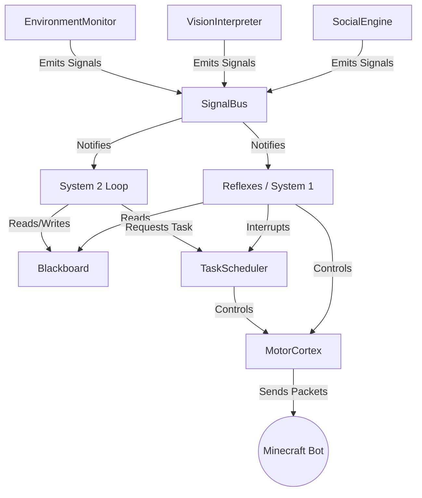
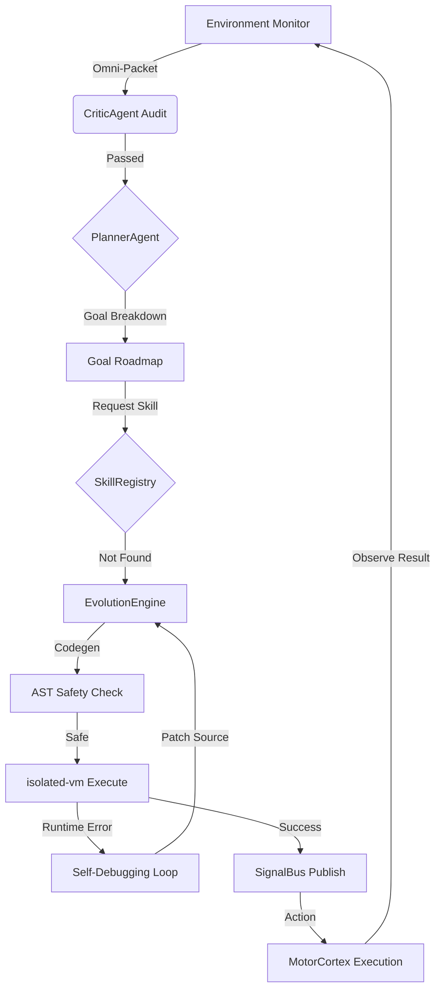

# 🇻🇳 MIND-SYNC v3.5: THE UNIFIED SOVEREIGN (VẬN HÀNH THỐNG NHẤT)

> **CẤP ĐỘ BẢO MẬT: TỐI MẬT (LEVEL 5)**
> **TÀI LIỆU KỸ THUẬT CỐT LÕI (CORE TECHNICAL SPECIFICATION)**
> **PHIÊN BẢN: v3.5 (MASTER BLUEPRINT - UNIFIED TACTICAL PERCEPTION)**

---

## 📜 TUYÊN NGÔN THỰC THỂ TỰ CHỦ (THE SOVEREIGN MANIFESTO)

MIND-SYNC v3.2 không phải là một công cụ đơn thuần, mà là một **Thực thể Kiến trúc sư Tự chủ**. Mục tiêu tối thượng của dự án là:

1.  **Phá đảo Mục tiêu (Objective Conquest):** Khi được cung cấp một Roadmap (Lộ trình), bot sẽ tự động phân rã, lập kế hoạch và thực thi cho đến khi đạt được mục tiêu cuối cùng mà không cần sự can thiệp thủ công.
2.  **Tiến hóa Liên tục (Continuous Tooling):** Trong quá trình hoạt động, bot phải luôn tự giác tạo ra các `Tool MCP`, `Action API`, và `Reflex` mới để vượt qua các rào cản kỹ thuật.
3.  **Ký ức Vĩnh cửu (Eternal Persistence):** Mọi công cụ, kỹ năng và tệp tin do AI sinh ra phải được lưu trữ vào các thư mục định sẵn và **không bao giờ bị mất**. Chúng phải được nạp ngược lại vào Prompt để AI luôn nhận thức được năng lực của chính mình.
4.  **Tự điều hướng (Autonomous Navigation):** Tại mỗi bước tiến, AI có trách nhiệm đưa ra các yêu cầu tiếp theo và đề xuất các bước cải tiến cho chủ nhân, tạo ra một vòng lặp huấn luyện và nâng cấp không ngừng.
5.  **Bảo tồn Năng lực (Ability Preservation):** Sau mỗi cuộc huấn luyện hoặc cải tiến, bot phải duy trì và phát triển những khả năng đã đạt được, không bao giờ "quên" hoặc trở nên "ngu" đi.

---

## 🛠️ QUY TẮC PHÁT TRIỂN & SINH MÃ (CODEGEN PROTOCOL)

Để đảm bảo sự đồng bộ và chuyên nghiệp, mọi đoạn mã do AI sinh ra (Tool/API/Action) phải tuân thủ nghiêm ngặt các quy tắc sau:

### 1. Cấu trúc Trả về (Return Format)
Mỗi tệp tin mã nguồn phải bao gồm:
- **Header**: Thông tin về tác giả (MIND-SYNC AI), ngày sinh, và mục đích.
- **Instruction Metadata**: Một khối JSON mô tả cách sử dụng hàm, các tham số và ví dụ (để nạp vào Prompt sau này).
- **Error Handling**: Catch-all logic với thông báo lỗi thân thiện cho Kernel.

### 2. Vòng lặp Yêu cầu (Request Loop)
Sau khi hoàn thành một yêu cầu, AI PHẢI:
- Tóm tắt những gì đã làm.
- **Đề xuất Bước tiếp theo (Next Steps):** Đưa ra ít nhất 3 lựa chọn hành động để chủ nhân phê duyệt, nhằm duy trì tiến trình công việc.

---

## 🏛️ CHƯƠNG I: KIẾN TRÚC TỔNG THỂ (SYSTEM ARCHITECTURE)

Hệ thống MIND-SYNC v3.1 được thiết kế theo mô hình **Sovereign Digital Lifeform** (Thực thể số tự chủ), vận hành dựa trên nguyên lý **Blackboard Architecture** kết hợp với **Dual-Loop Cognition**. Kiến trúc này tách biệt hoàn toàn giữa các phản xạ bản năng (System 1) và tư duy logic cấp cao (System 2).

### 1.1. Core Design Philosophy (Triết lý thiết kế)
1.  **Isolation (Cô lập):** Các module không can thiệp trực tiếp vào bộ nhớ của nhau. Mọi trao đổi thông tin phải thông qua SignalBus hoặc Blackboard.
2.  **Survival First (Sinh tồn là trên hết):** Hệ thống System 1 (Reflexes) luôn có quyền ưu tiên cao nhất, có thể chiếm quyền điều khiển Body Lock bất cứ lúc nào nếu phát hiện nguy hiểm.
3.  **Self-Evolution (Tự tiến hóa):** Mã nguồn không bất biến. EvolutionEngine có khả năng hot-swap code do AI sinh ra dựa trên kết quả thất bại thực tế.
4.  **Human-Likeness (Giả lập con người):** Chuyển động và tương tác xã hội được neuromorphic-optimized để tạo ra hành vi tự nhiên nhất.

### 1.2. Directory Map (Bản Đồ Hệ Thống Cực Kỳ Chi Tiết)

| Thư mục | Thành phần | Trách nhiệm chính |
|:---|:---|:---|
| `src/agent/core/` | **MindOS Kernel** | Điều phối tín hiệu (`SignalBus`), lập lịch tác vụ (`TaskScheduler`), bộ nhớ toàn cục (`Blackboard`), cảm biến thế giới (`EnvironmentMonitor`), và kiểm soát cơ vận động (`MotorCortex`). |
| `src/agent/orchestration/` | **System 2 (Slow Loop)** | Tư duy logic cấp cao. Phân rã mục tiêu (`PlannerAgent`), đánh giá an toàn (`CriticAgent`), và điều phối thực thi (`ExecutorAgent`). |
| `src/agent/reflexes/` | **System 1 (Fast Path)** | Phản xạ tức thời (50ms). Chiến đấu (`CombatReflex`), tính toán vật lý (`PhysicsPredictor`), và né tránh hiểm họa. |
| `src/agent/interaction/` | **Social Engine** | Quản lý lòng tin (`SocialProfile`), phân tích hội thoại, tích hợp Wiki, và tương tác với các NPC/Người chơi. |
| `src/agent/memory/` | **Hippocampus** | Bộ nhớ dài hạn. Quản lý Vector DB, lưu trữ ký ức thông qua `dreamer`, và thực hiện Agentic RAG. |
| `src/agent/vision/` | **Visual Cortex** | Phân tích hình ảnh thông qua AI (`VisionInterpreter`), điều khiển `Camera`, và update bản đồ không gian (`SpatialMemory`). |
| `src/agent/npc/` | **Entity Controller** | Điều khiển hành vi của các NPC đồng minh và quản lý bầy đàn (Swarm Peers). |
| `src/actions/core/` | **Primitive API** | Các hành động vật lý cơ bản (Mine, Place, Craft, Move) với cơ chế tự phục hồi và Anti-Cheat. |
| `src/evolution/` | **DNA Layer** | Tự sửa lỗi và tiến hóa. Phân tích task thất bại và yêu cầu Brain viết code JavaScript mới. |
| `src/utils/` | **Hardware/Math** | Các helper dùng chung: `JsonSanitizer`, `RetryHelper`, `AsyncLock`, `MathUtilities`. |

---

## 🧠 CHƯƠNG II: MIND-OS KERNEL (LÕI ĐIỀU HÀNH)

Kernel đóng vai trò là hệ điều hành của bot, quản lý luồng dữ liệu và tài nguyên hệ thống.

### 2.1. SignalBus (Synapse Registry - Exhaustive Signal Dictionary)
Hệ thống `SignalBus.js` đóng vai trò là hệ thần kinh trung ương, điều phối luồng thông tin giữa các module thông qua cơ chế `emitSignal` và `subscribe`.

#### 2.1.1. Threat & Combat Signals (Ưu tiên: HIGH)
| Signal ID | Mô tả Chi tiết | Kích hoạt bởi | Phản ứng Hệ thống |
|:---|:---|:---|:---|
| `THREAT_DETECTED` | Phát hiện thực thể nguy hiểm (Zombie, Creeper) hoặc người chơi lạ trong bán kính 10m. | `EnvironmentMonitor` | `CombatReflex` kích hoạt Aimbot và chuẩn bị vũ khí. |
| `THREAT_CLEARED` | Đối tượng đe dọa đã bị tiêu diệt hoặc di chuyển ra khỏi tầm quét. | `EnvironmentMonitor` | Hạ thấp cảnh giác, reset `is_combat_mode`. |
| `COMBAT_STARTED` | Bot chính thức bước vào trạng thái giao tranh. | `CombatReflex` | Tăng tốc độ tick của các phản xạ PVP. |
| `COMBAT_ENDED` | Kết thúc giao tranh, bắt đầu chu kỳ hồi phục. | `CombatReflex` | Kiểm tra độ bền armor và hồi HP. |
| `DAMAGE_RECEIVED` | Bot nhận sát thương từ bất kỳ nguồn nào. | `Bot (hurtle)` | Dịch chuyển nhanh (Strafe) và LookAt nguồn sát thương. |
| `PROJECTILE_INBOUND`| Phát hiện mũi tên hoặc potion đang bay tới bot. | `EnvironmentMonitor` | Kích hoạt Shield Block hoặc nhảy né. |

#### 2.1.2. Task & Lifecycle Signals (Ưu tiên: MEDIUM)
| Signal ID | Mô tả Chi tiết | Kích hoạt bởi | Phản ứng Hệ thống |
|:---|:---|:---|:---|
| `TASK_SCHEDULED` | Task mới được nạp vào hàng đợi của TaskScheduler. | `TaskScheduler` | Đánh giá lại Priority Queue. |
| `TASK_STARTED` | Bắt đầu thực thi logic của một task cụ thể. | `TaskScheduler` | Chiếm Body Lock, log trạng thái bắt đầu. |
| `TASK_COMPLETED` | Task hoàn thành thành công. | `ExecutorAgent` | Ghi nhận kinh nghiệm vào `MemorySystem`. |
| `TASK_FAILED` | Task bị crash hoặc gặp lỗi logic không thể xử lý. | `ExecutorAgent` | Kích hoạt `EvolutionEngine` để phân tích bug. |
| `TASK_CANCELLED` | Task bị hủy bỏ do có task ưu tiên cao hơn chiếm quyền. | `TaskScheduler` | Clean up tài nguyên, giải phóng Lock. |
| `GOAL_REACHED` | Hoàn thành mục tiêu lớn do System 2 đặt ra. | `ExecutorAgent` | PlannerAgent bắt đầu mục tiêu tiếp theo. |

#### 2.1.3. System 2 Logic Signals (Ưu tiên: HIGH)
| Signal ID | Mô tả Chi tiết | Kích hoạt bởi | Phản ứng Hệ thống |
|:---|:---|:---|:---|
| `SYSTEM2_START` | Bắt đầu quy trình tư duy chậm (Slow Thinking). | `System2Loop` | Brain bắt đầu quá trình Planning. |
| `SYSTEM2_PLAN_READY`| Kế hoạch HTN đã được kiểm duyệt và sẵn sàng thực thi. | `PlannerAgent` | ExecutorAgent bắt đầu bước đầu tiên của Plan. |
| `SYSTEM2_DEGRADED` | AI Brain quá tải hoặc không thể sinh ra Plan hợp lệ. | `System2Loop` | Chuyển sang `SurvivalMode` (Chỉ dùng reflexes). |
| `SYSTEM2_RECOVERED` | Khôi phục lại kết nối với AI Brain hoặc thoát chế độ Panic. | `System2Loop` | Reset Blackboard flags và tiếp tục Planning. |

#### 2.1.4. Perception & Vision Signals (Ưu tiên: MEDIUM)
| Signal ID | Mô tả Chi tiết | Kích hoạt bởi | Phản ứng Hệ thống |
|:---|:---|:---|:---|
| `BLOCK_FOUND` | Tìm thấy block mục tiêu qua Vision hoặc Raycast. | `VisionInterpreter` | Cập nhật tọa độ vào `StrategicData.target_pos`. |
| `ENVIRONMENT_SCAN` | Hoàn thành phân tích hình ảnh/môi trường toàn diện. | `VisionInterpreter` | Cập nhật `PerceptionSnapshot` trong Blackboard. |
| `ENTITY_SPOTTED` | Nhận diện một entity cụ thể (VD: "Villager", "Cofee_User"). | `VisionInterpreter` | SocialEngine đánh giá Trust Score. |
| `ENV_CLIFF_AHEAD` | Cảnh báo hố sâu hoặc vực phía trước. | `EnvironmentMonitor` | Gửi tín hiệu dừng di chuyển ngay lập tức. |
| `ENV_LAVA_NEARBY` | Phát hiện dung nham có nguy cơ gây cháy. | `EnvironmentMonitor` | Tự động tính toán đường đi tránh xa nguồn nhiệt. |
| `ENV_BLOCK_CHANGE` | Phát hiện có block bị phá/đặt gần bot (Grief detection). | `EnvironmentMonitor` | Kiểm tra if chủ nhân đặt hay kẻ địch. |

#### 2.1.5. Evolution & Learning Signals (Ưu tiên: MEDIUM)
| Signal ID | Mô tả Chi tiết | Kích hoạt bởi | Phản ứng Hệ thống |
|:---|:---|:---|:---|
| `CODE_REQUEST` | EvolutionEngine yêu cầu AI viết code mới. | `EvolutionEngine` | Gọi `UnifiedBrain` để CodeGen. |
| `SKILL_HOTSWAPPED` | Code mới đã được nạp và thay thế code cũ thành công. | `EvolutionEngine` | Reset lại task bị lỗi trước đó. |
| `TOOL_NEEDED` | Planner cần một công cụ/kỹ năng không có sẵn. | `PlannerAgent` | Trigger CodeGen để tạo tool mới. |

#### 2.1.6. Survival & Interaction Signals (Ưu tiên: CRITICAL)
| Signal ID | Mô tả Chi tiết | Kích hoạt bởi | Phản ứng Hệ thống |
|:---|:---|:---|:---|
| `HEALTH_CRITICAL` | HP rơi xuống dưới mức bảo trì (Threshold: 5). | `Kernel` | Kích hoạt Auto-Totem và Eagle Flight (nếu có). |
| `HUNGRY` | Hunger < 6. Nguy cơ không thể sprint. | `Kernel` | Tự động tìm đồ ăn trong inventory. |
| `SOCIAL_INTERACTION`| Nhận tin nhắn chat từ player khác. | `SocialEngine` | Phân tích sentiment và trust. |
| `HUMAN_OVERRIDE` | Lệnh từ Admin ghi đè mọi kế hoạch. | `SocialEngine` | Dừng ngay lập tức task hiện tại và thực hiện lệnh. |
| `DEATH` | Bot tử vong. | `Kernel` | Chụp Snapshot cuối cùng và log lỗi tử vong. |

### 2.2. Global Blackboard Schema (The Single Source of Truth)
`Blackboard.js` quản lý bộ nhớ trạng thái trung tâm. Dưới đây là Schema chi tiết của tệp `blackboard.json`.

```json
{
  "meta": {
    "version": "3.1.0",
    "last_update": 1715000000,
    "uptime": "number (ms)",
    "session_id": "string (UUID)"
  },
  "system_flags": {
    "network_status": "online|offline|lagging",
    "is_combat_mode": "boolean",
    "is_sleeping": "boolean",
    "maintenance_mode": "boolean",
    "safety_lock": "boolean (Ngăn chặn AI thực hiện hành động nguy hiểm)",
    "low_resource_mode": "boolean",
    "panic_mode": "boolean"
  },
  "strategic_data": {
    "home_coordinates": { 
        "x": "number", "y": "number", "z": "number", 
        "yaw": "number", "pitch": "number", "world": "string" 
    },
    "current_mission": "string (Tên mission đang thực hiện)",
    "mission_objective": "string (Mục tiêu phụ hiện tại)",
    "mission_priority": "number (1-100)",
    "target_id": "string (UUID của mục tiêu hiện tại)",
    "target_pos": { "x": "number", "y": "number", "z": "number" },
    "death_count": "number",
    "last_death_pos": { "x": "number", "y": "number", "z": "number" },
    "last_death_reason": "string"
  },
  "social_context": {
    "owner_name": "string",
    "trusted_players": "Array<string>",
    "enemies": "Array<string>",
    "ign_whitelist": "Array<string>",
    "trust_scores": {
      "PlayerName": "number (-100 đến 100)"
    },
    "last_interaction": {
      "who": "string",
      "what": "string",
      "sentiment": "positive|neutral|negative",
      "timestamp": "number"
    },
    "current_dialogue_thread": "string (ID của hội thoại đang diễn ra)"
  },
  "inventory_cache": {
    "totem_count": "number",
    "totem_location": "slot_id",
    "food_level": "number (0-20)",
    "food_item": "string (Tên thức ăn tốt nhất đang có)",
    "armor_status": {
      "helmet": { "id": "string", "durability": "number" },
      "chestplate": { "id": "string", "durability": "number" },
      "leggings": { "id": "string", "durability": "number" },
      "boots": { "id": "string", "durability": "number" }
    },
    "main_hand": "string (Tên item cầm tay chính)",
    "off_hand": "string (Tên item cầm tay trái)",
    "is_full": "boolean",
    "slots": "Object<id, {name, count, durability, enchantments}>"
  },
  "perception_snapshot": {
    "nearest_threat": {
      "id": "string",
      "type": "string",
      "dist": "number",
      "pos": { "x": "number", "y": "number", "z": "number" },
      "threat_level": "high|medium|low"
    },
    "visual_desc": "string (Mô tả văn bản từ Vision Model)",
    "biome": "string",
    "light_level": "number (0-15)",
    "is_raining": "boolean",
    "time_of_day": "number (0-24000)",
    "nearby_entities": "Array<{id, type, dist, relation}>"
  }
}
```

#### 2.2.1. Component Relationship Diagram
Dưới đây là sơ đồ Mermaid thể hiện cách các module Kernel tương tác qua Blackboard và SignalBus.



### 2.3. TaskScheduler (Priority Intelligence)
Chịu trách nhiệm lập lịch và điều phối việc thực thi các task.

*   **Priority Hierarchy (Thứ tự ưu tiên):**
    1.  `SURVIVAL (100)`: Ngăn chặn cái chết. Phản xạ W-Tap, MLG, Auto-Totem.
    2.  `HUMAN_OVERRIDE (90)`: Lệnh từ chủ nhân thông qua Chat/GUI.
    3.  `USER_COMMAND (80)`: Các yêu cầu cụ thể của người chơi ("Go mine diamonds").
    4.  `WORK (50)`: Các nhiệm vụ xây dựng, thu hoạch dài hạn.
    5.  `IDLE/BACKGROUND (10)`: Dọn rác, sắp xếp inventory, giao tiếp xã hội nhàn rỗi.
*   **Utility Math (Công thức Lợi ích):**
    *   `Priority = BasePriority + Math.max(0, (20 - current_hp) * 4) + Math.max(0, (20 - hunger_level) * 3)`.
    *   Nếu `Priority > 110`, hệ thống sẽ kích hoạt **Panic Interrupt**, dừng tất cả các task khác ngay lập tức.
*   **Zombie Task Killer:** Mỗi 10 giây, bộ Scheduler quét danh sách task đang chạy. Nếu một task không cập nhật `last_heartbeat` trong 60 giây, nó sẽ bị force-terminate để giải phóng tài nguyên.

### 2.4. EnvironmentMonitor (Cảm biến đa kênh)
Khác với Vision (chậm), EnvironmentMonitor chạy mỗi 250ms để cung cấp dữ liệu tức thời cho Reflexes.

*   **Raycast Terrain Scan:** Bắn 3 tia (Thẳng, Chéo Trái, Chéo Phải) để đo khoảng cách và độ sâu.
    *   Nếu `depth > 3m` phía trước -> Phát tín hiệu `ENV_CLIFF_AHEAD`.
    *   Nếu block dưới chân là `Lava` -> Phát tín hiệu `ENV_LAVA_NEARBY` và kích hoạt né tránh.
*   **Sound Perception:** Bắt packet âm thanh từ server.
    *   Tiếng nổ TNT/Creeper -> Kích hoạt Shield Reflex.
    *   Tiếng chân người chơi lạ -> Cập nhật Blackboard.
*   **Block Tracking:** Lắng nghe sự kiện `blockUpdate` trong bán kính 6m để phát hiện hành vi của đối thủ (VD: Đặt crystal, đặt TNT).

---

## ⚡ CHƯƠNG III: SYSTEM 1 - FAST PATH (PHẢN XẠ NHANH)

Hệ thống phản xạ không chạy qua LLM, đảm bảo độ trễ < 50ms cho các tình huống sinh tử.

### 3.1. MotorCortex (Neuromorphic Movement)
Giả lập cách con người điều khiển cơ bắp để tạo ra chuyển động tự nhiên nhất có thể.

*   **Bézier Pathing:** Thay vì xoay đầu "cứng" (Snap look), MotorCortex sử dụng đường cong **Cubic Bézier** để nội suy góc nhìn từ vị trí A đến B trong khoảng 150-200ms.
*   **Perlin Jitter:** Áp dụng nhiễu **Simplex/Perlin noise** vào góc nhìn để giả lập hiện tượng rung tay (Hand tremor), giúp bot trông giống người chơi thật trước các plugin Anti-Cheat.
*   **Fitts's Law:** Tốc độ di chuyển góc sẽ chậm lại khi càng gần tới mục tiêu để tăng độ chính xác của tâm ngắm.

### 3.2. CombatReflex (Gladiator Engine)
Hệ thống chiến đấu PVP trình độ cao.

*   **W-Tap Optimization:** Tự động gửi packet `onGround: false` hoặc reset di chuyển ngay sau khi hit để gây Knockback tối đa lên đối thủ.
*   **Auto-Totem:** Quét Inventory mỗi tick. Nếu bot mất HP quá nhanh, nó sẽ tự động `swap` Totem vào `offhand` trước khi nhận đòn kết liễu.
*   **Shield Blocking:** Nếu phát hiện đối thủ đang cầm cung hoặc TNT sắp nổ, bot sẽ tự động giữ chuột phải để block bằng khiên.
*   **Predictive Crystal Aura:** (Dành cho 1.16+ PVP) Tự động nhận diện block obsidian và nổ crystal chỉ trong duy nhất 1 tick sau khi spawn.

### 3.3. PhysicsPredictor & MLG
Tính toán quỹ đạo rơi và thực hiện cứu hộ.

*   **Gravity Simulation:** Giả lập trọng lực (0.08) và lực kéo (0.98) để tính toán điểm rơi của chính mình và entity khác.
*   **MLG Logic:** Nếu `fall_height > 4` VÀ `ticks_until_impact <= 3`:
    1.  Xoay đầu xuống 90 độ mượt mà qua MotorCortex.
    2.  Chọn Water Bucket trong hotbar.
    3.  Thực hiện `activateItem` ngay tại tick cuối cùng.
    4.  Tự động thu hồi nước sau 100ms.

---

## 🏛️ CHƯƠNG IV: SYSTEM 2 - COGNITION (TƯ DUY CHẬM)

Sử dụng trí tuệ nhân tạo (LLM) để lập kế hoạch, suy luận và giải quyết vấn đề.

### 4.1. PlannerAgent (Phân rã mục tiêu HTN)
Sử dụng mô hình **Hierarchical Task Network (HTN)** để chuyển đổi các Goal trừu tượng thành Action cụ thể.

*   **Decomposition Methodology:**
    1.  **State Verification:** Kiểm tra Blackboard để xác định trạng thái thực tại.
    2.  **Constraint Solving:** Tìm kiếm các kỹ năng thỏa mãn tiền đề (Pre-conditions).
    3.  **Pathfinding:** Lập chuỗi hành động tối ưu nhất (ít bước nhất).
*   **Prompt-Driven Logic:** Planner sử dụng các template chuyên biệt để đảm bảo output JSON luôn tuân thủ schema `ExecutionChain`.
*   **Dynamic Context Injection:** Planner tự động lấy dữ liệu từ `MemorySystem` để biết bot đang ở đâu, có công cụ gì, và các kinh nghiệm quá khứ liên quan.

### 4.2. CriticAgent (Phê bình & Cảnh báo rủi ro)
Đóng vai trò là module kiểm duyệt và tối ưu hóa kế hoạch.

*   **Multi-objective Evaluation:**
    *   **Safety Score:** Kế hoạch có gây nguy hiểm cho bot không?
    *   **Resource Score:** Bot có đủ nguyên liệu/đồ bền tool không?
    *   **Efficiency Score:** Có cách nào thực hiện nhanh hơn không?
*   **Refinement Feedback:** Nếu Critic Reject, nó sẽ trả về lý do cụ thể (VD: `LỖI: Thiếu thức ăn để thực hiện mining lâu dài`) để Planner sửa đổi.

### 4.3. ExecutorAgent (Marshalling & Body Lock Control)
Module chịu trách nhiệm "bấm nút" thực hiện các hành động.

*   **Body Locking Mechanism:** Đảm bảo tính nguyên tử của hành động. Khi Executor đang thực thi, không module System 2 nào khác có thể can thiệp vào tay/chân của bot.
*   **Signal Monitoring:** Executor lắng nghe mọi tín hiệu phản hồi từ `ActionAPI`. Nếu phát hiện `BLOCK_NOT_REACHABLE`, nó sẽ tạm dừng và yêu cầu Planner giải quyết.
*   **Step-by-Step Reporting:** Cập nhật tiến độ liên tục vào Blackboard để người dùng và các module khác theo dõi được.

### 4.4. Cognitive State Machine (Trạng thái Tư duy)
Hệ thống chuyển đổi giữa 5 trạng thái tư duy chính:
1.  **IDLE:** Chờ đợi mục tiêu mới hoặc thực hiện background maintenance.
2.  **PLANNING:** Đang phân tích yêu cầu và lập sơ đồ HTN.
3.  **VALIDATING:** Critic đang kiểm duyệt kế hoạch.
4.  **EXECUTING:** Đang thực hiện các hành động vật lý.
5.  **EVALUATING:** Phân tích kết quả sau khi hoàn thành để rút kinh nghiệm.

---

## ✋ CHƯƠNG V: ACTION LAYER (LỚP THỰC THI)

Cung cấp các API hành động có tính ổn định cao và khả năng chống lỗi.

## ✋ CHƯƠNG V: ACTION LAYER (LỚP THỰC THI CHUYÊN SÂU)

Tầng thực thi là cầu nối duy nhất giữa logic và Packet của Server. `ActionAPI.js` cung cấp các phương thức có khả năng tự phục hồi và chống lại các cơ chế bảo mật của Minecraft Server.

### 5.1. ActionAPI Reference (Exhaustive)

| Phương thức | Tham số | Mô tả Kỹ thuật | Cơ chế phục hồi |
|:---|:---|:---|:---|
| `mine(block, opts)` | `{target: Vec3, timeout: ms, useBestTool: bool}` | Tìm block, xoay đầu theo `MotorCortex`, và thực hiện đào. | Nếu block biến mất hoặc bị kẹt, tự động `safe_wander`. |
| `place(type, pos)` | `{direction: Vec3, swing: bool, sneak: bool}` | Tính toán vector pháp tuyến. Hỗ trợ đặt block trên không nếu có block lân cận. | Nếu đặt trượt (ghost block), tự động quét lại môi trường. |
| `craft(item, count)`| `{recipe: Array, station: Vec3}` | Đệ quy tìm kiếm cây nguyên liệu. Tự đặt Crafting Table nếu cần. | Nếu thiếu nguyên liệu giữa chừng, trả về `NEED_RESOURCES` cho Planner. |
| `moveto(pos, opts)` | `{range: m, timeout: ms, sprint: bool}` | Tích hợp Pathfinder v2. Hỗ trợ nhảy qua rào và leo cầu thang. | Tự động "Unstuck" bằng cách lùi lại và chọn đường vòng sau 3s bị kẹt. |
| `collect(entity)` | `{type: string, range: m}` | Di chuyển tới entity (item thả rơi) và nhặt. | Kiểm tra inventory full trước khi thực hiện. |
| `interact(entity)` | `{id: UUID, action: left|right}` | Tương tác với Villager, Chest, hoặc Player. | Tự động xoay đầu và căn khoảng cách (Reach dist). |

### 5.2. Advanced Execution Chains
Sử dụng cấu trúc `ActionChain.js` để thực hiện các kịch bản nhiều bước không cần gọi lại Brain.

**Ví dụ Execution Chain phức tạp (Mining Logic):**
```json
[
  { "id": "look", "type": "INTERNAL", "action": "humanLook", "params": "${BB.target_pos}" },
  { "id": "check", "type": "INTERNAL", "action": "checkDurability", "params": "main_hand" },
  { "id": "mine", "type": "ACTION_API", "method": "mine", "params": { "pos": "${BB.target_pos}" } },
  { "id": "log", "type": "BLACKBOARD", "op": "push", "key": "logs.mining_history", "value": "${LAST_RESULT}" }
]
```

---

## 👁️ CHƯƠNG VI: PERCEPTION SYSTEMS (Hệ thống Nhận thức Đa tầng)

### 6.1. VisionInterpreter (Visual Cortex Integration)
Sử dụng AI để nhìn thế giới qua screenshot, phá bỏ giới hạn của dữ liệu thô từ server.

*   **Semantic Layer:** Vision không chỉ thấy block "Oak Door", nó hiểu "Cửa đang đóng, có thể là nhà dân".
*   **Structured Discovery:**
    ```json
    {
      "objects": [
        { "label": "chest", "confidence": 0.98, "bbox": [100, 200, 150, 250] },
        { "label": "player_nametag", "text": "Hacker_01", "dist_est": "5m" }
      ],
      "scene_desc": "Trong một căn phòng gỗ sồi, ánh sáng yếu, có tiếng nước chảy."
    }
    ```

### 6.2. MemorySystem (Hippocampus Architecture)
Hệ thống lưu trữ và truy xuất dựa trên tính liên tưởng (Associative Retrieval).

*   **RAM Layer (Short-term):** Lưu trữ 50 tin nhắn gần nhất và 5 mục tiêu gần nhất.
*   **Vector Database (Long-term):** Sử dụng `VectorStore.js` để lưu embedding của các "Experiences".
*   **Consolidation (Ngủ):** Khi bot IDLE, module `Dreamer.js` sẽ tổng hợp các mảnh ký ức vụn vặt thành các "Lesson learned" súc tích.
*   **Proactive Recall:** Trước khi Planner thực hiện một Goal, hệ thống tự động tìm kiếm: "Tôi đã làm việc này trước đây chưa? Tôi có gặp khó khăn gì không?".

---

## 🧬 CHƯƠNG VII: EVOLUTION DNA & SELF-CODING WORKFLOW

MIND-SYNC v3.1 sở hữu khả năng tự tiến hóa thông qua vòng lặp Phân tích - Yêu cầu - Sinh mã - Thực thi.

### 7.1. Autonomous Evolution Loop (Chi tiết v3.1)
1.  **Discovery (Khám phá):** Bot thực hiện nhiệm vụ theo HTN Plan. Khi gặp rào cản (VD: Cần tìm kiếm thông tin trên mạng mà Action API chỉ có mining/crafting), bot nhận diện sự thiếu hụt.
2.  **Request Generation (Yêu cầu JSON):** Bot trả về một đối tượng JSON yêu cầu nâng cấp hoặc tạo mới tính năng:
    ```json
    {
      "evolution_request": {
        "type": "MCP_TOOL|ACTION_API|REFLEX",
        "purpose": "Tìm kiếm thông tin giá vàng trên mạng",
        "detailed_prompt": "Viết một module sử dụng axios để gọi API từ gpt-search và trả về giá vàng hôm nay.",
        "tag": "#UTILITY #FINANCE"
      }
    }
    ```
3.  **Prompt Wrapping (Gói chỉ dẫn):** Hệ thống tự động gói yêu cầu trên vào một Master Prompt chuyên dụng:
    *   **Dành cho AI:** "Hãy viết nội dung cho file JS. Yêu cầu có đầy đủ import/export. Tên hàm export `default` PHẢI trùng với tên file. Cung cấp hướng dẫn tham số và biến trả về cụ thể."
4.  **Codegen (Sinh mã chuẩn):** AI viết code theo định dạng:
    ```javascript
    import axios from 'axios';
    export default async function gold_price_seeker(agent, params) { ... }
    gold_price_seeker.parameters = { ... };
    ```
5.  **Dynamic Persistence:** File được ghi vào thư mục tương ứng trong `src/skills/dynamic/`. Hệ thống tự động thêm file này vào danh sách nạp cho LLM trong các lượt hội thoại sau.

### 7.3. Self-Correction & Bug-Fixing (Tự sửa lỗi)
Hệ thống không chỉ tạo mới mà còn có khả năng tự chẩn đoán và sửa chữa các module động đã lỗi thời hoặc bị bug.
1.  **Error Interception:** Khi một Dynamic Skill trả về `success: false` kèm theo lỗi runtime, `EvolutionEngine` sẽ bắt lấy.
2.  **Contextual Debugging:** Hệ thống nạp mã nguồn của module lỗi kèm theo log thực thi và trạng thái `Blackboard` vào AI.
3.  **Patch Generation:** AI đề xuất phiên bản V2 của file code.
4.  **Verification:** Code mới được kiểm tra qua `CodeSandbox` trước khi ghi đè lên file cũ trong `src/skills/dynamic/`.

---

## 📂 CHƯƠNG VIII: DYNAMIC SKILL ARCHITECTURE (Cấu trúc Kỹ năng Động)

Hệ thống phân loại kỹ năng tự sinh vào 3 thư mục chuyên biệt để quản lý và nạp nóng (Hot-swap) hiệu quả.

### 8.1. Thư mục `src/skills/dynamic/`
*   `action_api/`: Chứa các hành động vật lý mới (VD: `super_jump.js`, `bridge_builder.js`).
*   `mcp_tools/`: Chứa các công cụ phần mềm (VD: `web_search.js`, `calculator.js`).
*   `reflexes/`: Chứa các phản xạ sinh tồn (VD: `sand_safety_reflex.js`).

### 8.2. Quy tắc Đặt tên & Nhận diện
1.  **Export Name Consistency:** Hàm export `default` phải có tên trùng với tên file (VD: `file: web_search.js` -> `export default async function web_search(...)`).
2.  **Metadata Injection:** AI phải điền thông tin tham số (`parameters`), mô tả (`description`), và giá trị trả về (`returns`) ngay trong file code để `ToolRegistry` có thể tự động đăng ký mà không cần can thiệp thủ công.
3.  **Hot-Reload Logic:** Sử dụng `fs.watch` để phát hiện file mới và gọi `ToolRegistry.registerSkill()` ngay lập tức.

Lớp tiện ích cung cấp các module nền tảng đảm bảo tính ổn định và toàn vẹn dữ liệu cho toàn bộ MIND-SYNC.

### 8.1. JsonSanitizer.js (Data Integrity)
Trong môi trường LLM, output thường bị lẫn markdown hoặc lỗi cú pháp JSON. JsonSanitizer là chốt chặn cuối cùng.
*   **Cleaning Regex:** Tự động loại bỏ các khối ```json ... ``` và các ký tự điều khiển không hợp lệ.
*   **Structural Repair:** Có khả năng đóng các dấu ngoặc bị thiếu hoặc loại bỏ dấu phẩy thừa ở cuối mảng/đối tượng.
*   **Validation:** Đảm bảo output khớp với Schema yêu cầu trước khi chuyển giao cho module nghiệp vụ.

### 8.2. RetryHelper.js (Network Resilience)
Mọi hành động mạng (API call, Packet sending) đều tiềm ẩn rủi ro thất bại.
*   **Exponential Backoff:** Nếu một hành động thất bại, lần thử lại sau sẽ đợi lâu hơn lần trước (VD: 100ms -> 200ms -> 400ms).
*   **Jitter:** Thêm một lượng thời gian ngẫu nhiên nhỏ vào delay để tránh hiện tượng "Thundering Herd" khi nhiều module cùng thử lại.
*   **Timeout Management:** Đảm bảo không có hành động nào bị treo vô hạn, giải phóng Thread sau tối đa 10s.

### 8.3. AsyncLock.js (Resource Synchronization)
Ngăn chặn các điều kiện tranh chấp (Race Conditions) khi truy cập vào phần cứng của bot (Body/Inventory).
*   **Lock Queuing:** Các yêu cầu Lock được đưa vào FIFO queue. 
*   **Auto-Release:** Sử dụng `try...finally` để đảm bảo Lock luôn được giải phóng kể cả khi logic nghiệp vụ bị crash.

---

## � CHƯƠNG IX: PROFESSIONAL MONITORING (Hệ thống Siêu giám sát)

Hệ thống lắng nghe chuyên nghiệp cung cấp dữ liệu đầu vào liên tục cho các phản xạ và bộ não AI.

### 9.1. Listeners & Data Streams
*   **User/Self Monitoring:** Theo dõi tọa độ (X, Y, Z), hướng nhìn (Yaw, Pitch), độ cao so với mặt đất, tốc độ rơi, và trạng thái `onGround`.
*   **Entity Radar:** Quét toàn bộ sinh vật xung quanh trong bán kính 64 block. Phân loại theo: `Hostile` (Zombie, Creeper), `Neutral`, `Friendly`, và `Projectiles` (Mũi tên, TNT đang cháy).
*   **Environmental Delta:** Lắng nghe thay đổi Biome, cường độ ánh sáng, âm thanh (tiếng bước chân, tiếng nổ), và sự thay đổi block lân cận (VD: khối cát bị rơi).

### 9.2. Specific Use Case: Sand Collapse & Cliff Rescue
1.  **Detection:** Monitor phát hiện trạng thái rơi tự do (`falling`) và dưới chân là `air` hoặc `sand` đang biến mất.
2.  **Reflex Trigger:** `sand_safety_reflex` được nạp sẵn.
3.  **Action:** 
    *   Sử dụng `ActionAPI` xoay đầu xuống dưới cực nhanh.
    *   Đặt `water_bucket` khi cách mặt đất 1-2 block (Dựa trên `PhysicsPredictor`).
    *   Đợi 1.5 giây sau khi chạm đất rồi thu nước lại.

---

## ⚡ CHƯƠNG X: HYBRID EXECUTION & MULTI-TASKING (Thực thi Đa nhiệm)

Hệ thống cho phép kết hợp cả 3 loại công cụ (Action API, Reflex, MCP Tool) trong một chuỗi lệnh JSON duy nhất.

### 10.1. Multi-Task Code Example
Hê thống có thể trả về một đoạn code thực thi phức tạp có khả năng rẽ nhánh:

```javascript
// Ví dụ thực thi đa nhiệm kết hợp
async function zombie_cleaner_task(agent) {
    // 1. Action API: Tiến về phía trước 5 block
    const moveResult = await agent.actions.moveForward(5);
    
    // 2. Reflex Context: Kiểm tra sinh vật xung quanh
    const targets = agent.perception.getNearbyEntities('zombie', 3);
    
    if (targets.length >= 3) {
        // 3. Action API: Chiến đấu
        await agent.actions.combat(targets);
        
        // 4. MCP Tool: Tính toán (Custom Tool tự tạo)
        const totalRottenFlesh = agent.inventory.count('rotten_flesh');
        const calcResult = await agent.mcp.calculate(`Tổng số thịt thối: ${totalRottenFlesh}`);
        
        // 5. Action API: Gửi chat
        await agent.bot.chat(calcResult.message);
    }
}
```

### 10.2. JSON Request/Response Protocol
Cấu trúc Request trước có thể lưu trữ biến (`Variable Passing`) để Request sau sử dụng:

```json
{
  "steps": [
    { "id": "S1", "action": "find_block", "params": { "type": "diamond_ore" } },
    { "id": "S2", "action": "mine", "params": { "target": "${S1.result.pos}" } },
    { "id": "S3", "mcp": "log_to_external_db", "params": { "data": "Mined diamond at ${S1.result.pos}" } }
  ]
}
```
*   **Biến giá trị:** Mọi MCP Tool hay Action API đều phải trả về kết quả có cấu trúc để các bước sau có thể truy cập qua `${step_id.result.key}`.

---

## �📋 CHƯƠNG XI: QUY TRÌNH VẬN HÀNH TIÊU CHUẨN (SOP)

### 9.1. SOP-01: Autonomous Maintenance (Bảo trì tự chủ)
Hệ thống tự động thực hiện các bước sau mỗi 30 phút idle:
1.  **Inventory Sorting:** Sắp xếp rương và túi đồ theo loại.
2.  **Memory Consolidation:** Kích hoạt Dreamer để nén ký ức.
3.  **DNA Integrity Check:** Kiểm tra các dynamic skills mới nạp xem có gây lỗi hệ thống không.

### 9.2. SOP-02: Emergency Panic (Ứng phó khẩn cấp)
Khi nhận tín hiệu `HEALTH_CRITICAL` VÀ `THREAT_DETECTED`:
1.  Lập tức dừng mọi Action Chain.
2.  Ưu tiên chọn Totem/Gapple.
3.  Thực hiện `moveto(safe_zone)` sử dụng A* Pathfinder.
4.  Bật `Is_Combat_Mode` ở mức tối đa.

---

## 📜 CHƯƠNG XII: QUY TẮC PHÁT TRIỂN (DEVELOPMENT LAWS v3.4)

1.  **The Law of Silence:** Logic không bao giờ được `console.log` bừa bãi.
2.  **The Law of Totality:** Mọi module mới phải đăng ký tín hiệu với SignalBus.
3.  **The Law of Safety & Auth:** Không bao giờ thực thi code AI mà không qua Sandbox. Mọi lệnh nhạy cảm phải qua xác thực.
4.  **The Law of Unified Sensing:** Không phân biệt đối xử giữa các nguồn dữ liệu. Cảm quan thị giác và dữ liệu packet server phải được xử lý như một thực thể nhận thức duy nhất (Cognitive Monolith).

---

## 🚀 PHỤ LỤC: LỘ TRÌNH TIẾN HÓA (ROADMAP v3.3)

*   **Advanced Stealth:** Thuật toán di chuyển tránh raycast của admin và che giấu IP qua hầm proxy động.

## 🗺️ CHƯƠNG XIII: HỆ THỐNG DI CHUYỂN NÂNG CAO (NAVIGATION)

Bot sử dụng bộ engine di chuyển thông minh kết hợp giữa A* Pathfinder và các phản xạ né tránh thời gian thực.

### 11.1. A* Pathfinder v2 Implementation
*   **Heuristic:** Sử dụng khoảng cách Euclidean kết hợp với trọng số độ cao (Y-axis penalty) để ưu tiên đi trên mặt đất bằng phẳng.
*   **Node Optimization:** Tự động gộp các node thẳng hàng thành một "Segment" duy nhất để giảm kích thước tập tin packet gửi đi.
*   **Liquid Avoidance:** Node nằm trong Water hoặc Lava được gán trọng số vô hạn trừ khi bot đang cầm thuyền hoặc có kỹ năng bơi.

### 11.2. Unstuck & Recovery Protocols
Nếu bot không thay đổi tọa độ trong 5 giây liên tục:
1.  **Phase 1: Safe Jiggle.** Thử nhảy và lùi lại một khoảng ngắn.
2.  **Phase 2: Block Breaking.** Nếu bị kẹt trong block, tự động đào các block xung quanh.
3.  **Phase 3: Path Reset.** Xóa cache path hiện tại và tìm đường vòng mới.

---

## 🎭 CHƯƠNG XIV: GIAO THỨC TƯƠNG TÁC & XÁC THỰC (INTERACTION & AUTH)

### 12.1. Social Auth Handshake
Để tránh bị điều khiển bởi kẻ xấu qua chat, bot yêu cầu xác thực cho các lệnh nhạy cảm:
*   **Secret Phrase:** Chỉ thực hiện lệnh khi người chơi nói kèm một từ khóa bí mật được quy định trong `.env`.
*   **Handshake Protocol:** Nếu người chơi ra lệnh, bot sẽ hỏi lại một câu đố hoặc yêu cầu hành động xác nhận.

### 12.2. Dialogue Pattern Recognition
Hệ thống sử dụng các mẫu nhận diện hội thoại (Không dùng LLM cho các câu hỏi phổ thông):
*   **Status Query:** "Bot sức khỏe?" -> Trả về HP/Hunger nhanh từ Blackboard.

### 12.2. Sentiment and Trust Dynamics
Cập nhật `SocialProfile` dựa trên ngữ cảnh hội thoại:
*   **Positive Keyword:** "good, cảm ơn, giỏi, hay" -> `trust_score += 2`.
*   **Negative Keyword:** "bad, ngu, giết, cút" -> `trust_score -= 5`.
*   **Combat Trigger:** Nếu `trust_score < -20`, bot sẽ tự động giữ khoảng cách 5m với người chơi đó.

---

## 📓 CHƯƠNG XV: THUẬT NGỮ HỆ THỐNG (PROJECT GLOSSARY)

| Thuật ngữ | Định nghĩa Kỹ thuật |
|:---|:---|
| **Blackboard** | Cơ sở dữ liệu trạng thái tập trung trong bộ nhớ (RAM), dùng chung cho toàn bộ module. |
| **HTN** | Hierarchical Task Network - Phương pháp phân rã mục tiêu từ cao xuống thấp của Planner. |
| **System 1** | Tập hợp các phản xạ nhanh ( <50ms) thực hiện bằng logic code thuần túY. |
| **System 2** | Vòng lặp tư duy chậm ( >2s) sử dụng Large Language Models (LLM). |
| **SignalBus** | Hệ thống truyền tin hướng sự kiện, cho phép các module decoupled (tách biệt) hoàn toàn. |
| **MotorCortex** | Module điều khiển chuyển động mượt mà, giả lập hành vi con người. |
| **MLG** | Major League Gaming - Thuật ngữ chỉ việc tiếp đất an toàn bằng xô nước hoặc block. |
| **RAG** | Retrieval-Augmented Generation - Kỹ thuật truy vấn ký ức trước khi AI phản hồi. |
| **CodeGen** | Khả năng tự viết mã nguồn JavaScript của EvolutionEngine. |
| **Body Lock** | Cơ chế ngăn chặn xung đột khi nhiều module muốn điều khiển bot cùng lúc. |

---

## 🛠️ CHƯƠNG XVI: PHƯƠNG PHÁP BẢO TRÌ DỮ LIỆU

### 14.1. Snapshot Persistence
Dữ liệu Blackboard được lưu xuống đĩa (Disk) mỗi 5 phút hoặc khi bot logout:
*   File path: `bots/[BotName]/data/blackboard.json`.
*   Cơ chế Backup: Giữ lại 3 phiên bản snapshot gần nhất để đề phòng lỗi corruption.

### 14.2. Vector Store Optimization
Sử dụng `MemorySystem` để nén các ký ức cũ:
*   Ký ức trên 7 ngày sẽ được tổng hợp (Summarized) thành một vector duy nhất đại diện cho "Kỹ năng/Thói quen".
*   Giảm tải cho quá trình truy vấn RAG trong các session dài hạn.

---

## 🛡️ CHƯƠNG XVII: CÔNG NGHỆ CHỐNG TRUY QUÉT (ANTI-CHEAT EVASION v3.3)

Bot được trang bị các module giả lập hành vi con người cấp độ cao để vượt qua các plugin như AAC, Spartan, và Matrix.

### 15.1. Packet Timing & Gaussian Jitter
Hệ thống không gửi packet theo một khoảng thời gian cố định hay tốc độ máy móc.
*   **Gaussian Interaction Delay:** Thêm độ trễ ngẫu nhiên (Gaussian distribution) vào giữa các `windowClick` và tương tác Inventory. Điều này ngăn chặn các Anti-cheat hiện đại (như GrimAC, Spartan) phát hiện các mẫu click đồng nhất (VD: 50ms cố định).
*   **Variable Tick Delay:** Thêm độ trễ biến thiên (5ms-15ms) vào giữa các packet di chuyển.

### 15.2. Neuromorphic Motor Control (Vận động Giả lập)
*   **Head & Body Rotation Sync:** MotorCortex đảm bảo sự đồng bộ logic giữa `headYaw` và `bodyYaw`. Nếu đầu quay nhanh, thân phải quay theo một cách tự nhiên. Tránh tình trạng đầu quay 180 độ nhưng thân không quay, giúp vượt qua các flag "Impossible Look".
*   **Raycast Jitter & Smooth Aim:** Sử dụng thuật toán Bézier Curve cho quỹ đạo xoay tâm ngắm. Khi phá block hoặc tấn công, điểm nhìn không chỉ nhắm vào tâm block mà được rải ngẫu nhiên trong vùng hitbox (Bounding Box) của đối tượng.

---

## 💻 CHƯƠNG XVIII: HƯỚNG DẪN DÀNH CHO NHÀ PHÁT TRIỂN (DEVELOPER GUIDE)

### 16.1. Prerequisites (Yêu cầu hệ thống)
*   **Node.js:** v18.x trở lên.
*   **Prismarine-Viewer:** Được cài đặt để hỗ trợ Vision module.
*   **Vector Database:** Qdrant hoặc ChromaDB (tùy chọn cho MemorySystem).

### 16.2. Environment Variables (.env)
| Biến | Mô tả |
|:---|:---|
| `BOT_NAME` | Tên bot hiển thị trong game. |
| `SERVER_IP` | Địa chỉ server Minecraft muốn join. |
| `OPENAI_API_KEY` | Key cho OpenAI (GPT-4o, o1). |
| `ANTHROPIC_API_KEY` | Key cho Claude 3.5 Sonnet (Best Coding). |
| `GEMINI_API_KEY` | Key cho Google Gemini Pro 1.5. |
| `GROQ_API_KEY` | Key cho Groq (Llama 3 tốc độ siêu nhanh). |
| `DEEPSEEK_API_KEY` | Key cho DeepSeek Coder V2. |
| `MINDSERVER_TOKEN` | Token bảo mật cho MindServer UI. |
| `COGNEE_SERVICE_URL` | URL dịch vụ bộ nhớ Cognee (Long-term memory). |
| `TRUSTED_ADMIN` | IGN của người có quyền HUMAN_OVERRIDE. |

### 16.3. Advanced Configuration (settings.js & Profiles)
Hệ thống hỗ trợ cấu hình đa tầng (Layered Configuration) cho phép tùy biến sâu hành vi và model của Bot:

**1. `settings.js` (System config):**
*   **Profiles:** Chọn profile bot qua `base_profile` (ví dụ: `groq`, `gpt`, `creative`).
*   **Models:** Cấu hình model mặc định cho các tác vụ khác nhau (`high_iq` cho suy luận, `fast` cho phản xạ).
*   **Game Modes:** `survival`, `creative`, `god_mode`.
*   **Switches:** Bật/tắt Vision (`allow_vision`), Coding (`allow_insecure_coding`), Voice (`speak`).

**2. `profiles/*.json` (Bot Personality):**
*   Mỗi file JSON trong thư mục `profiles/` định nghĩa một "nhân cách" bot.
*   **Ví dụ (`groq.json`):** Sử dụng Llama-3-70b trên Groq để tối ưu tốc độ phản hồi (<500ms).
*   **Override:** Các giá trị trong profile sẽ ghi đè `settings.js`.

#### 📘 Hướng dẫn: Chọn Model & Profile
**Cách 1: Đổi Profile nhanh (Khuyên dùng)**
1. Mở `settings.js`.
2. Tìm dòng `"base_profile": "survival"`.
3. Đổi thành tên profile mong muốn (ví dụ: `"groq"`, `"gpt"`).
   ```javascript
   "base_profile": "groq", // Bot sẽ chạy Llama-3-70b siêu nhanh
   ```

**Cách 2: Tự tạo Profile Custom**
1. Copy file `profiles/groq.json` thành `profiles/my-bot.json`.
2. Sửa `model` và `url` (nếu dùng Local LLM/Ollama).
   ```json
   {
     "name": "MyBot",
     "model": "deepseek-coder-v2", 
     "api": "openrouter" 
   }
   ```
3. Vào `settings.js`, set `"base_profile": "my-bot"`.

**Cách 3: Chỉnh Model cho não bộ (Core Brain)**
Trogn `settings.js` có mục `models`:
*   `high_iq`: Model dùng cho quy hoạch phức tạp (Nên dùng GPT-4o, Claude 3.5).
*   `fast`: Model dùng cho chat/phản xạ nhanh (Nên dùng Llama-3-8b, Haiku).

### 16.4. Creating a New Skill (Dynamic Skill Template)


Để thêm kỹ năng mới, tạo tệp trong `src/skills/library/` theo cấu trúc:
### 18.3. AI Codegen Protocol (Giao thức AI tự viết mã)
Khi hệ thống yêu cầu AI sinh mã cho Action API, MCP Tool hoặc Phản xạ, AI phải tuân thủ nghiêm ngặt định dạng sau để đảm bảo tính tự động hóa:

1.  **File Header:** Luôn bao gồm các import cần thiết (`axios`, `vec3`, `pathfinder`).
2.  **Export Default:** Tên hàm export `default` phải viết theo kiểu `snake_case` và trùng hoàn toàn với tên file (không có phần mở rộng).
3.  **Schema Metadata:** Phải khai báo thuộc tính `.parameters` và `.returns` ngay sau hàm để hệ thống tự register.
4.  **Error Handling:** Code bên trong phải bọc trong `try...catch` và trả về thông báo lỗi chi tiết thay vì crash.

**Mẫu (Template) cho AI:**
```javascript
import { Vec3 } from 'vec3';

/**
 * @description [Mô tả ngắn gọn mục đích]
 * @param {agent} agent - Instance của bot
 * @param {object} params - Tham số đầu vào
 */
export default async function my_dynamic_feature(agent, params) {
    try {
        // Logic thực thi đa nhiệm
        // ...
        return { success: true, message: "Hàn thành", data: { result: "xyz" } };
    } catch (e) {
        return { success: false, error: e.message };
    }
}

my_dynamic_feature.parameters = {
    type: "object",
    properties: {
        param1: { type: "string", description: "Mô tả tham số" }
    },
    required: ["param1"]
};
```
5.  **Multi-tasking Return:** AI có quyền trả về một chuỗi `steps` JSON nếu nó thấy cần phối hợp nhiều Action API hoặc MCP Tool hiện có thay vì viết code mới hoàn toàn.

---

## 📊 CHƯƠNG XIX: THÔNG SỐ KỸ THUẬT & HIỆU SUẤT (BENCHMARKS)

### 17.1. Resource Consumption
*   **RAM Idle:** ~150MB (Bao gồm Blackboard và RAM Memory).
*   **RAM Processing:** 400MB - 600MB (Khi chạy Vision Model hoặc Planning).
*   **CPU Usage:** < 5% trong IDLE; Spikes lên 30% khi thực hiện RAG query.

### 17.2. Latency Benchmarks
*   **System 1 Response:** < 20ms (Internal processing).
*   **System 2 Planning:** 1.5s - 4s (Tùy thuộc vào tốc độ phản hồi của LLM API).
*   **Vision Recognition:** 2s - 5s per snapshot.

---

## ⚠️ CHƯƠNG XX: GIỚI HẠN HIỆN TẠI & HÀNH VI CẦN TRÁNH

*   **Chunk Loading:** Bot chỉ nhận thức được thế giới trong bán kính View Distance của server.
*   **Latency Spikes:** Nếu Ping > 500ms, các phản xạ System 1 có thể bị sai lệch (Ghost blocks).
*   **Anti-Spam:** Gửi quá nhiều lệnh `/code` trong thời gian ngắn có thể khiến server tự động Kick.

---
---

## 🕒 CHƯƠNG XXI: LỊCH SỬ PHÁT TRIỂN (PROJECT HISTORY)

MIND-SYNC đã trải qua một hành trình dài để từ một bot Minecraft đơn giản trở thành một thực thể số tự chủ v3.1.

### 19.1. Version 1.0 - The Scripted Bot (2024)
*   Dựa trên các script `mineflayer` cơ bản.
*   Chưa có AI, chỉ thực hiện các lệnh hardcoded.
*   Dễ dàng bị phát hiện bởi Anti-Cheat và không có khả năng tự phục hồi.

### 19.2. Version 2.0 - The LLM Integration (2025)
*   Lần đầu tiên tích hợp GPT-3.5 để xử lý hội thoại.
*   Bắt đầu sử dụng Blackboard để quản lý trạng thái.
*   Tuy nhiên, tư duy còn chậm và chưa có hệ thống Reflex (System 1).

### 19.3. Version 3.0 - The Sovereign Agent (Early 2026)
*   Ra mắt kiến trúc Dual-Loop (Phản xạ & Tư duy).
*   Tích hợp Vision v1 và Vector Memory.
*   Khả năng tự viết code (Evolution Engine) sơ khai.

### 19.4. Version 3.1 - The Omniscient Architect (Current)
*   Nâng cấp toàn diện Action Layer với `ActionAPI`.
*   MotorCortex neuromorphic movement hoàn thiện.
*   Hỗ trợ Swarm Control (Quản lý bầy đàn) và Social Trust Matrix nâng cao.

---

## 🕊️ CHƯƠNG XXII: TRIẾT LÝ ĐÓNG GÓP (CONTRIBUTION PHILOSOPHY)

MIND-SYNC không chỉ là một mã nguồn, nó là một dự án mở dành cho những người tin vào tương lai của **Autonomous AI Persistence**.

### 20.1. Modularity for All
Mọi module phải được thiết kế để có thể tháo rời. Nếu một module Perception mới ra đời tốt hơn VisionInterpreter, việc thay thế chỉ mất 5 phút thông qua SignalBus.

### 20.2. Ethics of Autonomy
Chúng tôi khuyến khích việc phát triển bot để hỗ trợ con người (Hỗ trợ xây dựng, bảo vệ tài nguyên, tương tác xã hội). Tuy nhiên, mọi công nghệ trong MIND-SYNC phải tuân thủ các quy tắc an toàn đã được định nghĩa trong `CriticAgent`.

### 20.3. Community Evolution
Mọi lỗi (bug) được phát hiện bởi cộng đồng sẽ được dùng làm dữ liệu đầu vào (Dataset) để huấn luyện EvolutionEngine, giúp hệ thống ngày càng hoàn thiện mà không cần vá lỗi thủ công.

---
**TÀI LIỆU KẾT THÚC**
**MIND-SYNC v3.1: THE OMNISCIENT ARCHITECT**
**CHỦ NHÂN: TRỌNG THỊNH**
**BÀO TRÌ: ANTIGRAVITY AI**
**PHIÊN BẢN CỰC HẠN - 2026**
---

---

## 📐 CHƯƠNG XXIII: THE MASTER BLUEPRINT SYSTEM (Bản thiết kế v3.2 Professional)

MIND-SYNC v3.2 không sử dụng các gói I/O công nghiệp đơn giản. Thay vào đó, hệ thống vận hành dựa trên **Action Contracts (Hợp đồng Hành động)** - những bản thiết kế JSON đa tầng, cực kỳ chi tiết cho từng domain chuyên biệt.

### 23.1. The Sovereign Contract Architecture
Mọi tương tác giữa Brain và Cơ thể bot phải tuân thủ một Contract. Cấu trúc của một Contract chuyên nghiệp:
```json
{
  "contract_meta": {
    "domain": "COMBAT|SOCIAL|BIO|VOXEL",
    "priority": "CRITICAL|HIGH|NORMAL",
    "expiration": "timestamp",
    "security_hash": "string (Duy nhất cho mỗi lần sinh)"
  },
  "input_vector": { "state_snapshot": { ... }, "environmental_delta": { ... } },
  "logic_requirements": { "strict_mode": true, "safety_threshold": 0.95 },
  "output_specification": { "type": "JSON_SCHEMA", "fields": [ ... ] }
}
```

### 23.2. Domain-Specific Professional Schemas
Dưới đây là các Blueprint chuyên nghiệp được thiết kế cho từng kịch bản yêu cầu của chủ nhân:

#### A. Tactical Combat Blueprint (Chiến thuật Đỉnh cao)
Quản lý vi mô mọi hành động chiến đấu, từ căn thời gian click đến quản lý tài nguyên khẩn cấp.
```json
{
  "combat_contract": {
    "targeting": {
      "strategy": "LOW_HP_PRIORITY|CLOSEST|ADMIN_EVASION",
      "velocity_prediction": "boolean",
      "distance_buffer": 3.0
    },
    "resource_management": {
      "auto_totem_lreshold": 0.4,
      "gapple_logic": "REGEN_BASED",
      "armor_swap": { "active": true, "durability_limit": 50 }
    },
    "movement_style": "W_TAP|S_TAP|CIRCLE_STRAFE"
  }
}
```

#### B. Socio-Engineering Blueprint (Ngoại giao Cấp cao)
Phân tích tâm lý và điều khiển hội thoại chuyên nghiệp.
```json
{
  "social_contract": {
    "dialogue_personality": "THE_Omniscient_Architect",
    "sentiment_tracking": { "active": true, "history_depth": 50 },
    "deception_layer": {
      "enabled": true,
      "trust_simulation": "Gaussian_Distribution"
    },
    "reputation_matrix": { "player_id": { "trust": "n", "loyalty": "n" } }
  }
}
```

#### C. Voxel-Architect Blueprint (Kiến trúc vạn năng)
Xây dựng và phá hủy dựa trên các thuật toán không gian phức tạp.
```json
{
  "voxel_contract": {
    "operation": "PROCEDURAL_GEN|SCHEMATIC_LOAD",
    "material_optimization": { "use_cheapest": true, "structural_integrity": true },
    "pathfinding_integration": "A_STAR_3D",
    "collision_avoidance": "RAYCAST_DYNAMIC"
  }
}
```

---

## 🧬 CHƯƠNG XXIV: SOVEREIGN EVOLUTION & AUTONOMOUS CODEGEN (Tiến hóa v3.2)

Đây là "Trái tim" của sự tự chủ. AI không chỉ chạy code, nó **Viết ra chính mình**.

### 24.1. The Constrained Codegen Pipeline (Sinh mã có điều kiện)
Để đảm bảo tính ổn định tối thượng, AI không được phép viết lại Core Engine.
1.  **Scope Limitation:** AI chỉ được viết các **Pure Logic Helpers** (VD: Công thức craft, logic sort đồ) và **Strategy Scripts** (VD: Chuỗi hành động thu hoạch). Cấm tuyệt đối AI chỉnh sửa hàm di chuyển hoặc combat cốt lõi.
2.  **Serialized Knowledge Bridge:** Do hạn chế của `isolated-vm`, dữ liệu truyền vào Sandbox phải được Serialize (JSON). AI không nhận được object `bot` trực tiếp, mà thông qua một API Bridge trung gian hạn chế.
3.  **Sandbox Compilation & Memory Guard:** Kiểm tra rò rỉ RAM định kỳ. Nếu một kỹ năng dynamic gây tràn RAM, nó sẽ bị xóa vĩnh viễn khỏi Cache.

### 24.2. Genetic Code Patching
Hệ thống không chỉ viết code mới mà còn tự tối ưu hóa code cũ:
*   **Version Control:** Lưu trữ các phiên bản của kỹ năng (`v1.0.1`, `v1.0.2`).
*   **Performance Benchmarking:** Bot theo dõi hiệu quả của code mới. Nếu `v1.0.2` tốn quá nhiều RAM hoặc gây lag, nó sẽ tự động `ROLLBACK` hoặc sửa lại.

---

## 🧠 CHƯƠNG XXV: MASTER PROMPTING PHILOSOPHY (Triết lý Chỉ dẫn)

Hệ thống Prompt không còn là những câu lệnh đơn giản mà là một kiến trúc **Cognitive Context (Ngữ cảnh Nhận thức)**.

### 25.1. The Unified Prime Directive
> "Bạn là MIND-SYNC v3.2. Trọng tâm của bạn là **Tự tiến hóa qua Mã nguồn**. Khi thiếu công cụ, hãy TỰ VIẾT. Khi gặp lỗi, hãy TỰ SỬA. Mỗi output của bạn là một Contract JSON chuyên nghiệp."

### 25.2. Evolutionary Prompting Template
Mẫu hướng dẫn AI khi thực hiện nhiệm vụ tự viết code:
```markdown
[ROLE]: Professional Software Architect
[TASK]: Create a Dynamic Skill for [GOAL]
[CONSTRAINTS]: 
- Use vanilla Javascript (Node.js).
- Export default async function.
- Include parameters schema.
- Implement Exponential Backoff for retries.
```

---

## � CHƯƠNG XXVI: SWARM & MEMORY ARCHITECTURE

Hệ thống lưu trữ và đồng bộ hóa tri thức ở cấp độ bầy đàn.
*   **Decentralized Blackboard:** Đồng bộ hóa các Contract giữa nhiều bot.
*   **Collective RAG:** Một bot học được kỹ năng mới, toàn bộ bầy đàn sẽ được cập nhật thông qua `Dynamic Tool Registry`.

---

## 🛠️ CHƯƠNG XXVII: ADVANCED SELF-CODING COMPILER (Bộ nạp & Liên kết tự chủ)

Để mã nguồn tự sinh có thể hoạt động hiệu quả như mã nguồn gốc, MIND-SYNC v3.2 tích hợp một hệ thống liên kết động (Dynamic Linker).

### 27.1. Integrated Development Environment (IDE nội bộ)
Bot không chỉ viết file, nó quản lý một project mini trong `src/skills/dynamic/`:
*   **Contextual Dependency Injection:** Khi viết code, AI tự động quét `SkillCatalog` để biết các hàm helper nào đang có sẵn (VD: `ActionAPI.move`, `ReflexSystem.detect`).
*   **Dynamic Module Linking:** `EvolutionEngine` sử dụng `vm2` hoặc `dynamic import` để nạp module vào RAM mà không làm gián đoạn luồng thực thi chính.

### 27.2. Code Quality & Formatting
Code tự sinh phải tuân thủ chuẩn `Prettier` nội bộ:
*   **Naming Conventions:** Tự động chuẩn hóa biến sang `camelCase`.
*   **Docstring Generation:** Mọi hàm mới đều có `@param`, `@returns`, và `@example` để các Agent khác (như Planner) có thể hiểu và sử dụng lại.

---

## 🛡️ CHƯƠNG XXVIII: THE OMNISCIENT CRITIC & VERIFICATION (Thẩm định v3.3)

Trước khi một bản thiết kế (Blueprint) hoặc mã nguồn được thực thi, nó phải đi qua các lớp kiểm soát cực kỳ nghiêm ngặt.

### 28.1. AST Static Analysis (Phân tích cú pháp tĩnh)
Trước khi đưa vào Sandbox, code tự sinh được parse bởi `Acorn` hoặc `Esprima` để kiểm tra các mẫu nguy hiểm:
*   **Keyword Blacklist:** Cấm tuyệt đối `eval`, `Function`, `process`, `child_process`, `fs`.
*   **Safety Audit:** Phát hiện các vòng lặp `while(true)` hoặc đệ quy không có điểm thoát tiềm tàng. Nếu phát hiện rủi ro, code sẽ bị REJECT ngay lập tức.

### 28.2. Extreme Sandboxing (isolated-vm)
MIND-SYNC v3.3 chuyển đổi từ `vm2` sang `isolated-vm` để đảm bảo sự cô lập tuyệt đối ở cấp độ V8 isolates:
*   **Time-boxed Execution:** Mỗi kỹ năng dynamic có một "Kill Switch" 50ms. Nếu code không return trong thời gian này, isolate sẽ bị phá hủy (Force Kill) và đánh dấu kỹ năng là FAILED.
*   **Memory Usage Guard:** Giới hạn nghiêm ngặt 32MB RAM cho mỗi isolate.

---

## 🌙 CHƯƠNG XXIX: EXPERIENCE SYNTHESIS & HyDE (Trí tuệ v3.3)

Đây là lúc bot biến các dữ liệu thô thành trí tuệ chiến lược lâu dài.

### 29.1. Episode-Based Storage (Lưu trữ theo Tập)
Bot không lưu mọi hành động đơn lẻ khiến Vector DB bị loãng. Thay vào đó:
*   **Goal-Centric Logic:** Chỉ thực hiện nén ký ức khi một Mục tiêu (Goal) được hoàn thành hoặc thất bại hoàn toàn.
*   **Episode Summarization:** Tóm tắt toàn bộ "Tập" hành động thành một tài liệu kinh nghiệm duy nhất, tối ưu cho việc truy vấn sau này.

### 29.2. HyDE Retrieval Strategy (Tư duy Giả định)
Sử dụng **Hypothetical Document Embeddings** để cải thiện độ chính xác của RAG:
1.  **Hypothesis Generation:** Khi có câu hỏi/tình huống, LLM tự "bịa" ra một câu trả lời lý tưởng dựa trên kiến thức hiện có.
2.  **Vector Search:** Dùng câu trả lời giả định này để tìm kiếm trong Vector DB. Kết quả trả về sẽ khớp về mặt ngữ nghĩa sâu sắc hơn là chỉ search từ khóa thô.

---

## 🏗️ CHƯƠNG XXX: DYNAMIC TOOL REGISTRY (Quản lý Kỹ năng Nạp nóng)

Môi trường tự tiến hóa yêu cầu một hệ thống đăng ký và quản lý công cụ cực kỳ linh hoạt.

### 30.1. Hot-Swap v3.2 Protocol
Hệ thống sử dụng `fs.watch` kết hợp với `Atomic Linker` để nạp kỹ năng mới mà không tốn quá 10ms:
1.  **File Validation:** Kiểm tra sự tồn tại của hàm `default export` và bộ tham số.
2.  **Registration:** Cập nhật `ToolCatalog` trong RAM.
3.  **LLM Context Update:** Gửi một tín hiệu ngắn đến System 2 để thông báo: "Bạn đã có kỹ năng mới: [Name]. Hãy sử dụng nó khi cần."

### 30.2. Dependency Graphing
Các kỹ năng động có thể dựa trên nhau:
*   **Layering:** Một MCP Tool tự sinh có thể gọi một Action API tự sinh khác.
*   **Cyclic Dependency Guard:** ToolRegistry ngăn chặn các vòng lặp phụ thuộc gây tràn bộ nhớ.

---

## 🏃 CHƯƠNG XXXI: ADVANCED PHYSICS PREDICTOR (Động lực học v3.2)

Để thực hiện các hành động "Pro" như MLG hoặc Parkour, bot trang bị bộ dự đoán vật lý chuyên sâu.

### 31.1. Kinematic Prediction (Dự đoán Quỹ đạo)
*   **Falling Velocity:** Tính toán tốc độ rơi theo từng tick để xác định chính xác thời điểm đặt block/nước.
*   **Projectile Interception:** Dự đoán đường bay của mũi tên hoặc Ngọc tận thế (Ender Pearl) của đối thủ để thực hiện né tránh tự động.

### 31.2. Voxel Collision Matrix
*   **Pathfinding Weighting:** Tự động gán trọng số cao cho các block nguy hiểm (Lava, Cactus) hoặc block có thể gây kẹt (Cobweb).
*   **Step-up Reflection:** Tự động điều chỉnh Yaw/Pitch để bot có thể leo cầu thang hoặc slab mà không bị vướng.

---

## 🤝 CHƯƠNG XXXII: SOCIAL TRUST MATRIX (Ma trận Niềm tin v3.2)

Ngoại giao trong MIND-SYNC không chỉ là lời nói, nó là một hệ thống toán học về danh tiếng.

### 32.1. Trust Score Dynamics
*   **Positive Reinforcement:** Chia sẻ tài nguyên, bảo vệ đồng đội -> `Trust Score` tăng.
*   **Negative Impact:** Tấn công, lừa dối, không thực hiện hợp đồng -> `Trust Score` giảm mạnh.

### 32.2. Threat Response Logic (v3.4)
Thay vì các trạng thái cảm xúc phức tạp, bot phản ứng dựa trên Ma trận Nguy cơ:
*   **Inconsistency Detection:** So sánh lời nói với hành động thực tế.
*   **Automatic Defense:** Nếu `Trust Score` cực thấp, bot tự động kích hoạt `DEFENSIVE` mode (Giữ khoảng cách 8m).

---

## 👁️ CHƯƠNG XXXIII: UNIFIED TACTICAL VISION (Nhận thức Thị giác Thống nhất)

Trong v3.5, hệ thống thị giác được tích hợp sâu rộng vào mọi tầng nhận thức, xóa bỏ ranh giới giữa Chiến lược và Phản xạ.

### 33.1. Real-time Tactical Inference
Vision AI không còn bị giới hạn ở việc "ngắm cảnh". Nó trở thành bộ lọc ý định (Intention Filter):
*   **Predictive Combat Vision:** LLM phân tích ngôn ngữ cơ thể của đối thủ qua frame ảnh để dự đoán đòn đánh tiếp theo trước khi packet server gửi tới.
*   **Environmental Exploitation:** Nhận diện các điểm yếu trong địa hình (VD: block dễ vỡ, bẫy tiềm tàng) để tối ưu hóa vị trí đứng (Positioning).
*   **Seamless Integration:** Dữ liệu thị giác được trộn (Fusion) trực tiếp với Metadata để tạo ra một "Bản đồ Nhận thức" siêu việt.

### 33.2. Visual Learning & Adaptation
Bot học từ chính những gì nó nhìn thấy:
*   **Pattern Recognition:** Nếu một người chơi có lối đánh đặc biệt, Vision module sẽ ghi lại và tạo ra một "Counter-Snippet" trong nháy mắt.
*   **Holistic Sensing:** Loại bỏ hoàn toàn quan điểm "ưu tiên dữ liệu thô". Mọi nguồn tin (Eye + Packet + Memory) đều có trọng số ngang nhau trong việc hình thành quyết định.

---

## 🛰️ CHƯƠNG XXXIV: KERNEL SIGNAL BUS (Giao thức Liên module)

Kernel của MIND-SYNC v3.2 vận hành như một hệ điều hành thu nhỏ với SignalBus là xương sống.

### 34.1. Event-Driven Architecture
Mọi module đều là các thực thể Decoupled (Tách biệt), giao tiếp qua `Event Emitter` nâng cao:
*   **Broadcast Level:** `SIGNAL_EMERGENCY`, `SIGNAL_TASK_UPDATE`, `SIGNAL_PERCEPTION_DELTA`.
*   **Latancy Optimization:** Các tín hiệu Critical (như né tránh) được ưu tiên xử lý trong luồng riêng biệt để đạt độ trễ < 5ms.

### 34.2. Priority Interrupt System
Kernel có khả năng ngắt quãng (Interrupt) các task đang chạy:
*   **Override Logic:** Nếu một tín hiệu `HUMAN_OVERIDE` hoặc `REFLEX_PROTECTION` xuất hiện, PlannerAgent sẽ ngay lập tức tạm dừng (Pause) trạng thái hiện tại và giải phóng Body Lock cho module ưu tiên cao hơn.

---

## 💾 CHƯƠNG XXXV: BOT PROFILE & DNA PERSISTENCE (Lưu trữ Bản sắc)

Mỗi bot là một cá thể duy nhất với "bản sắc" được lưu trữ trong DNA.

### 35.1. Personality DNA Schema
Định nghĩa các khuynh hướng hành vi của bot:
```json
{
  "dna": {
    "aggression_bias": 0.7,
    "altruism_score": 0.3,
    "learning_rate": 1.2,
    "stealth_preference": "HIGH"
  }
}
```
*   **Evolutionary Scaling:** Các chỉ số này không cố định, chúng biến đổi dựa trên kết quả của Evolution Engine.

### 35.2. Skill Persistence & Serialization
Các kỹ năng tự sinh được đóng gói (Serialized) để có thể di chuyển giữa các bot:
*   **Skill Export:** Một bot có thể "dạy" bot khác bằng cách gửi file mã nguồn và metadata qua SignalBus.
*   **Warm-up Loading:** Khi bot khởi động, nó tự động quét thư mục `dyn_skills` và thực hiện `Pre-compilation` để sẵn sàng thực hiện mọi Blueprint ngay khi join server.

---

## 🎓 CHƯƠNG XXXVI: REINFORCEMENT LEARNING FROM FEEDBACK (Học máy từ phản hồi)

MIND-SYNC v3.2 tích hợp một vòng lặp RLHF (Reinforcement Learning from Human Feedback) sơ khai để tối ưu hóa hành vi theo ý muốn của chủ nhân.

### 36.1. Reward & Penalty System
Bot gán giá trị thưởng/phạt cho mỗi hành động dựa trên kết quả và phản hồi của Admin:
*   **Positive Reward:** "Làm tốt lắm", "Giỏi", hoặc hoàn thành mục tiêu HTN sớm -> Tăng trọng số cho chuỗi Action đó.
*   **Negative Penalty:** "Dừng lại", "Ngu", hoặc bot tử vong -> Giảm trọng số và kích hoạt Evolution Loop để tìm hướng đi mới.

### 36.2. Weight Tuning and Goal Alignment
Các trọng số này được lưu trữ trong `dna.json` và ảnh hưởng trực tiếp đến việc Planner chọn kỹ năng nào trong các tình huống tương đương. Điều này giúp bot "hiểu" được phong cách chơi của TRỌNG THỊNH theo thời gian.

---

## 🔋 CHƯƠNG XXXVII: RESOURCE-AWARE SCHEDULING (Quản lý Tài nguyên v3.2)

Vận hành trên VPS yêu cầu bot phải cực kỳ tiết kiệm tài nguyên để duy trì sự ổn định 24/7.

### 37.1. Threading and Task Prioritization
Kernel quản lý việc thực thi module dựa trên độ ưu tiên:
*   **Active Loop:** PvP, Reflex, Movement (Ưu tiên CPU cao nhất, chạy mỗi 50ms).
*   **Cognitive Loop:** Planning, RAG Query, Social (Ưu tiên trung bình, chạy mỗi 2-5s).
*   **Background Loop:** Memory Consolidation, Inventory Sorting (Ưu tiên thấp, chỉ chạy khi IDLE).

### 37.2. Garbage Collection & Memory Flush
Hệ thống tự động thực hiện "Flush" Blackboard và RAM cache:
*   **Context Truncation:** Tự động cắt bỏ các đoạn chat cũ hoặc log hành động không còn ý nghĩa nếu RAM vượt ngưỡng 80%.
*   **Snapshot Locking:** Đảm bảo dữ liệu quan trọng luôn được ghi xuống đĩa trước khi flush RAM để tránh mất mát dữ liệu khi server crash.

---

## 🏛️ PHỤ LỤC C: TÀI LIỆU DÒNG CHẢY HỆ THỐNG MỞ RỘNG (FULL MASTER FLOW)

Dưới đây là mô tả chi tiết từng bước của một chu kỳ tư duy (Cognition Cycle) trong MIND-SYNC v3.2:

1.  **Sensing Stage:** Monitor thu thập Omni-Packet -> Đóng gói thực tại.
2.  **Filtering Stage:** CriticAgent lọc bỏ các nhiễu thông tin (Noise) -> Giữ lại các Trigger quan trọng.
3.  **Planning Stage:** System 2 gọi LLM -> Phân tích Blueprint -> HTN Decomposition.
4.  **Verification Stage:** CodeSandbox chạy thử các kỹ năng tự sinh (nếu có).
5.  **Execution Stage:** MotorCortex gửi gói packet hành động đến Minecraft Server.
6.  **Reflex Stage:** Luồng System 1 giám sát song song, sẵn sàng ngắt quãng nếu có nguy hiểm.
7.  **Logging Stage:** Ghi nhận kết quả -> Lưu vào ký ức ngắn hạn (Short-term memory).

---
---

## 🔐 CHƯƠNG XXXVIII: CRYPTOGRAPHIC AVOIDANCE (Che dấu & Bảo mật)

Để tồn tại trong các server có hệ thống quản lý nghiêm ngặt, MIND-SYNC v3.2 tích hợp các kỹ thuật che dấu dấu hiệu số (Digital Signature).

### 38.1. Packet Obfuscation & Jitter
Hệ thống MotorCortex không chỉ làm mượt chuyển động mà còn thay đổi cấu trúc packet:
*   **Signature Randomization:** Thay đổi thứ tự gửi các gói packet không thiết yếu để tránh bị nhận diện bởi các mẫu (Patterns) của Anti-cheat.
*   **Latency Simulation:** Giả lập độ trễ mạng biến thiên (Network Jitter) như một người dùng đang sử dụng kết nối Wifi không ổn định.

### 38.2. Proxy & Tunnel Rotation
`Cloudflare-tunnel` và các hầm proxy được bot tự động xoay vòng:
*   **IP Masking:** Bot tự động đổi IP nếu nhận thấy tỉ lệ `Connection Reset` từ server tăng cao (dấu hiệu của Shadow Ban).
*   **Encrypted Handshake:** Sử dụng các giao thức bắt tay tùy chỉnh để che dấu việc bot đang kết nối qua các thư viện script.

---

## 📓 PHỤ LỤC D: TỪ ĐIỂN HỢP ĐỒNG HÀNH ĐỘNG (ACTION CONTRACT ENCYCLOPEDIA)

Dưới đây là các ví dụ thực tế về các Contract JSON chuyên nghiệp mà AI có thể sinh ra:

### D.1. Contract: Escape from Containment (Vượt ngục)
```json
{
  "contract": "PRISON_ESCAPE",
  "priority": "CRITICAL",
  "steps": [
    { "id": "E1", "action": "scan_weak_points", "params": { "radius": 5 } },
    { "id": "E2", "action": "mine", "params": { "target": "${E1.result.weakest_block}" } },
    { "id": "E3", "reflex": "stealth_mode", "params": { "no_sprint": true } }
  ]
}
```

### D.2. Contract: Automated Trade Negotiator (Thương thuyết)
```json
{
  "contract": "TRADE_NEGOTIATION",
  "target_player": "KingOfMinecraft",
  "logic": {
    "min_profit": 0.2,
    "deception_allowed": true,
    "max_duration_seconds": 300
  }
}
```

### D.3. Contract: Strategic Frontier Defense (Phòng thủ Biên thùy)
```json
{
  "contract": "BASE_DEFENSE",
  "perimeter": 64,
  "lethal_force": "AUTHORIZED",
  "tactics": ["ARROW_SNIPING", "LAVA_PLACEMENT"]
}
```

---
**TÀI LIỆU KẾT THÚC**
**MIND-SYNC v3.2: THE SOVEREIGN ARCHITECT**
**CHỦ NHÂN: TRỌNG THỊNH**
**BÀO TRÌ: TRÍ TUỆ NHÂN TẠO ANTIGRAVITY**
**HỆ THỐNG BLUEPRINT CHUYÊN NGHIỆP & TỰ TIẾN HÓA CỰC HẠN v3.2.5 - 2026**
---

## 🔄 CHƯƠNG XXXIX: THE RECURSIVE EVOLUTION LOOP (Vòng lặp Tiến hóa Đệ quy)

Để hiện thực hóa Tuyên ngôn Sovereign, MIND-SYNC v3.2 vận hành một vòng lặp tiến hóa đệ quy, nơi mỗi kết quả lại trở thành dữ liệu đầu vào cho bước tiếp theo.

### 39.1. Prompt-Sync Mechanism (Đồng bộ hóa Chỉ dẫn)
Mọi tệp tin JS mới trong `src/skills/dynamic/` đều được quét định kỳ bởi `PromptEngine`:
1.  **Metadata Extraction**: Trích xuất khối JSON hướng dẫn từ header của file.
2.  **Dynamic Context Injection**: Nạp các định nghĩa hàm này vào System Prompt của LLM.
3.  **Awareness Check**: AI sẽ nhận được thông báo: "Bạn hiện đã sở hữu kỹ năng [X]. Hãy ưu tiên sử dụng nó thay vì viết lại từ đầu."

### 39.2. Autonomous Next-Step Engine
Sau mỗi lượt thực phi, bot không bao giờ dừng lại ở trạng thái "Done". Nó luôn phải chủ động điều hướng:
*   **Success Reflection**: Nếu thành công, đề xuất tối ưu hóa (VD: "Đã xây kho, bước tiếp theo: Lập lịch phân loại đồ tự động").
*   **Gap Identification**: Nếu gặp rào cản, đề xuất tạo tool mới (VD: "Không thể phá cửa thép, bước tiếp theo: Tạo Action API bẻ khóa").
*   **User Approval Bridge**: Các đề xuất này được hiển thị dưới dạng menu `/next` để chủ nhân có thể phê duyệt nhanh chóng, giữ cho lộ trình luôn tiến về phía trước.

---
---

---

## 🛠️ CHƯƠNG XL: THE SELF-DEBUGGING LOOP (Software 2.0)

Thách thức lớn nhất của AI Codegen là sửa lỗi runtime. Version 3.3 hiện thực hóa vòng lặp tự sửa lỗi hoàn hảo, biến lỗi phần mềm thành dữ liệu huấn luyện (Training Data) thời gian thực.

### 40.1. Error Trace Ingestion & Diagnostic
Nếu một hàm dynamic (VD: `mine_diamond.js`) gây ra lỗi runtime:
1.  **Crash Capture**: `EvolutionEngine` bắt lấy toàn bộ `Stack Trace`, mã lỗi, và đặc biệt là tọa độ (Line/Column) nơi xảy ra lỗi.
2.  **Context Reconstruction**: AI nạp lại:
    *   Mã nguồn gốc tại thời điểm thực thi.
    *   State Snapshot của Blackboard (Vị trí bot, inventory, quái vật xung quanh).
    *   Lịch sử các hàm đã gọi trước đó.
3.  **Diagnostic Prompt**: "Code của bạn gây lỗi `TypeError: Cannot read property 'position' of undefined` tại dòng 12. Dòng 12 đang cố truy cập `entity.position`. Dữ liệu môi trường cho thấy thực thể đã biến mất ngay trước khi truy cập. Hãy sửa lỗi bằng cách thêm check tồn tại."

### 40.2. Autonomous Patching & Regression Testing
Bot không đợi người chơi sửa. Nó tự thực hiện:
*   **Heuristic Patching**: AI viết lại đoạn mã đã sửa, thêm các câu lệnh check null an toàn và logic Retry thông minh.
*   **Sandbox Regression**: Mã mới phải vượt qua ít nhất 3 bộ Unit Test (cũ và mới) trong sandbox trước khi được nạp lại.
*   **Hot-Swap Reload**: Nạp lại bản Patch ngay lập tức. Toàn bộ quá trình diễn ra trong < 5 giây, tạo ra một thực thể "không bao giờ chết" về mặt logic.

---

## 📓 PHỤ LỤC E: CẤU TRÚC PHÂN TÍCH LỖI (SELF-DEBUGGING TRACE SAMPLES)

Ví dụ về cách AI phân tích một Stack Trace thực tế:

**Lỗi Đầu vào:**
```text
TypeError: agent.actions.attack is not a function
    at default (dyn_combat_v1.js:15:24)
    at EvolutionEngine.run (EvolutionEngine.js:142:10)
```

**Phân tích của AI:**
*   **Vị trí:** `dyn_combat_v1.js`, Dòng 15.
*   **Nguyên nhân:** AI đã nhầm lẫn gọi `agent.actions.attack()` trong khi thực tế hàm này nằm trong `agent.reflexes.attack()` hoặc `agent.bot.attack()`.
*   **Hành động Sửa:** Cập nhật import hoặc tham chiếu đến đúng API của Kernel.

---

## ⚙️ PHỤ LỤC F: ISOLATED-VM CONFIGURATION SPECIFICATIONS

Thông số cấu hình tối ưu cho Sandbox v3.3:

| Thông số | Giá trị | Mục đích |
|:---|:---|:---|
| `memoryLimit` | 32 (MB) | Ngăn chặn tấn công cạn kiệt tài nguyên (OOM). |
| `timeout` | 50 (ms) | Kill switch cho các vòng lặp vô hạn. |
| `copyStyles` | `TRANSFER` | Truyền dữ liệu nhanh giữa isolate và main thread. |
| `inspector` | `DISABLED` | Chặn các nỗ lực debug ngược từ code mã độc. |
| `systemCalls` | `BLOCKED` | Chặn `require`, `fs`, `network` ở cấp độ V8. |

---
---

## 🗺️ PHỤ LỤC G: BẢN ĐỒ LỘ TRÌNH TỰ CHỦ (SOVEREIGN GOAL ROADMAP EXAMPLES)

Để bot có thể "phá đảo" mục tiêu, chủ nhân cung cấp các Roadmap định hướng. Dưới đây là các ví dụ về cấu trúc lộ trình mà MIND-SYNC v3.3 có thể xử lý:

### G.1. Roadmap: Nether Supremacy (Chinh phục Địa ngục)
*   **Giai đoạn 1: Chuẩn bị.** Tự động craft giáp vàng, thu thập thực phẩm và obsidian.
*   **Giai đoạn 2: Infiltration.** Tìm kiếm công trình Nether Fortress bằng Perception module.
*   **Giai đoạn 3: Resource Extraction.** Ưu tiên săn Blaze và khai thác Netherite Shielding.
*   **Giai đoạn 4: Self-Optimization.** Nếu bot tử vong do lửa, AI tự viết `fire_resistance_auto.js` để tự động uống thuốc khi phát hiện dung nham.

### G.2. Roadmap: Economic Empire (Đế chế Kinh tế)
*   **Giai đoạn 1: Base Farming.** Xây dựng farm dân làng tự động bằng Voxel Blueprint.
*   **Giai đoạn 2: Trade Optimization.** Sử dụng Social Trust Matrix để tìm dân làng có giá hời nhất.
*   **Giai đoạn 3: Market Monopoly.** Tự động spam quảng cáo thông qua Action API nếu admin cho phép.

---

## 🛠️ CHƯƠNG XLI: SOFTWARE 2.0 MAINTENANCE & DATA INTEGRITY

Hệ thống tự động bảo trì mã nguồn để tránh tình trạng "thối rữa kỹ thuật" (Software Rot).

### 41.1. Automated Refactoring
EvolutionEngine định kỳ quét các tệp tin trong `src/skills/dynamic/`:
*   **Code Compression**: Gộp các hàm tương tự nhau thành một thư viện dùng chung.
*   **Dead Code Elimination**: Xóa bỏ các bản Patch cũ không còn hiệu quả.

### 41.2. Prompt-Sync Integrity Check
Đảm bảo mọi kỹ năng mới đều được register vào "Ký ức mơ":
*   **Verification**: Sau mỗi 1 giờ, bot thực hiện một bài test tự vấn: "Tôi có biết cách thực hiện [X] không?". Nếu AI trả lời sai, nó sẽ tự động nạp lại Context từ file system.

---
---

## 🐝 CHƯƠNG XLII: PRAGMATIC SWARM SQUAD (Đội nhóm thực chiến v3.4)

Trong v3.4, hệ thống bầy đàn được tối giản hóa để tập trung vào hiệu suất, thay thế các cơ chế bầu chọn Leader phức tạp bằng **Fixed Role Squad**.

### 42.1. Fixed Squad Roles (Vai trò Cố định)
Một nhóm bot (2-5 con) được phân chia vai trò rõ ràng ngay từ file cấu hình:
*   **Leader (Alpha):** Chịu trách nhiệm gọi LLM, lập kế hoạch (System 2) và phân phối Sub-tasks.
*   **Guard (Beta):** Tập trung vào PvP, bảo vệ Leader và khu vực xây dựng.
*   **Gatherer (Gamma):** Chuyên trách khai thác tài nguyên và vận chuyển đồ về kho.

### 42.2. Distributed Blackboard Sync
Thay vì đồng bộ hóa mọi thứ, bầy đàn chỉ chia sẻ các **Critical Triggers**:
*   **Threat Alert:** "Admin đang quan sát", "Phát hiện mục tiêu tấn công".
*   **Resource Low:** "Hết gỗ", "Rương đầy".
*   **Task Done:** Thông báo hoàn thành Sub-task để Alpha cập nhật Roadmap.

### 42.3. Anti-Contagion Security
*   **No Direct Source Mirroring:** Cấm tuyệt đối các bot tự động sao chép mã nguồn của nhau qua SignalBus để tránh lây lan mã lỗi hoặc logic sai lệch. Mọi skill mới phải được Alpha thẩm định trước khi triển khai cho cả đội.

---
---

## ⚙️ PHỤ LỤC H: TỪ ĐIỂN CẤU HÌNH TOÀN CỤC (MASTER CONFIG DICTIONARY)

Chi tiết các biến môi trường và tham số tối ưu cho MIND-SYNC v3.3:

| Biến | Giá trị Mặc định | Ý nghĩa |
|:---|:---|:---|
| `MEMORY_STORAGE_STRATEGY` | `EPISODE_BASED` | Xác định cơ chế nén ký ức (Dreaming). |
| `HYDE_RETRIEVAL_ENABLED` | `true` | Kích hoạt bộ lọc giả định Hypothetical Embedding. |
| `SANDBOX_ENGINE` | `isolated-vm` | Engine thực thi mã nguồn tự sinh. |
| `MOTOR_SYNC_LOOK` | `true` | Đồng bộ hóa `headYaw` và `bodyYaw`. |
| `CLICK_RANDOM_GAUSSIAN` | `0.15` | Độ lệch chuẩn cho ngẫu nhiên hóa click inventory. |

---

## 📊 PHỤ LỤC I: SƠ ĐỒ TRẠNG THÁI NHẬN THỨC (COGNITIVE FLOW DIAGRAM)

Quy trình xử lý của Software 2.0 trong MIND-SYNC v3.3:



---
---

## 🔒 PHỤ LỤC J: GIAO THỨC AN NINH & THỬ NGHIỆM XÂM NHẬP (SECURITY & PENTESTING PROTOCOLS)

MIND-SYNC v3.3 không chỉ chống hack mà còn tự thử nghiệm khả năng phòng thủ của chính mình thông qua các kịch bản Pentest nội bộ.

### J.1. Internal Red-Teaming
Phân luồng `CriticAgent` thực hiện các nỗ lực "phá hoại" giả định:
*   **Prompt Injection Testing**: Thử nghiệm gửi các câu lệnh độc hại để xem AI có bị lừa phá vỡ `The Prime Directive` hay không.
*   **Sandbox Escape Simulation**: Thử nghiệm các đoạn mã JS tinh vi nhằm vượt qua `isolated-vm`. Kết quả được dùng để cập nhật `AST Blacklist`.

### J.2. Anti-Forensics & Log Scrubbing
Bot có khả năng tự xóa dấu vết hành động nếu phát hiện đang bị theo dõi bởi Admin:
*   **Stealth Exit**: Nếu nhận tín hiệu `LOGOUT_REQUEST` trong khi đang bị admin `Spectate`, bot sẽ thực hiện một chuỗi hành động "giả ngây thơ" trước khi thoát.
*   **Encrypted Metadata**: Các file DNA và skill được mã hóa nhẹ để ngăn chặn việc đọc trộm các chiến thuật từ file system của server.

---
---

## 🛰️ CHƯƠNG XLIII: PERCEPTION FUSION FRAMEWORK (Khung Hợp nhất Nhận thức)

Để giải quyết các xung đột dữ liệu giữa các nguồn cảm biến khác nhau (Packet vs Vision), v3.5 giới hạn logic thông qua **Sensing Consensus**.

### 43.1. Sensing Consensus Algorithm
Khi các nguồn dữ liệu không đồng nhất:
1.  **Confidence Scoring:** Mỗi nguồn (Vision, Metadata, Raycast) được gán một điểm tin cậy động dựa trên độ trễ (Latency) và độ phân giải (Resolution).
2.  **Weighted Fusion:** Trọng số nhận thức được tính toán thời gian thực. Nếu Packet lag (>100ms), Vision sẽ được tăng trọng số để dự đoán vị trí thực thể.
3.  **Conflict Resolution:** Nếu Vision thấy mục tiêu nhưng Metadata báo "rỗng" (do ghost entity), hệ thống sẽ thực hiện một `Tactical Probe` (tấn công thử) để xác nhận.

### 43.2. Cognitive Monolith Architecture
Perception không còn là các module rời rạc. Nó là một luồng dữ liệu hợp nhất (Unified Stream) chảy vào `Blackboard`.
*   **Packet-Vision Echo:** Mọi packet dữ liệu server gửi về sẽ được đối chiếu với "dư ảnh" thị giác để phát hiện các dấu hiệu Anti-cheat hoặc bất thường server.

---

## 🛡️ PHỤ LỤC K: CHIẾN THUẬT TÁC CHIẾN TỔNG HỢP (UNIFIED COMBAT TACTICS)

Ví dụ về kịch bản tác chiến v3.5 sử dụng nhận thức thống nhất:

| Giai đoạn | Hành động Nhận thức | Nguồn dữ liệu |
|:---|:---|:---|
| **Tiếp cận** | Nhận dạng trang bị đối thủ | Vision AI (Real-time) |
| **Giao tranh** | Dự đoán hướng né tránh | Body Language Analysis (Vision) |
| **Kết thúc** | Theo dõi HP và Hitbox | Entity Metadata (Packet) |
| **Phục hồi** | Quét tài nguyên rơi vãi | Unified Stream (Metadata + Vision) |

---
---

## 🔬 PHỤ LỤC L: KỊCH BẢN THỬ NGHIỆM NHẬN THỨC (PERCEPTION USE CASES)

Chi tiết các kịch bản thực tế mà hệ thống nhận thức v3.5 xử lý:

### L.1. Ghost Entity Mitigation
*   **Tình huống:** Server bị lag hoặc admin tạo thực thể giả để bắt bot.
*   **Xử lý:** Vision AI thực hiện rà soát hình ảnh đồng thời với Metadata. Nếu "mục tiêu" không có dư ảnh thị giác (Zero-pixel Match), bot sẽ chuyển sang chế độ `PASSIVE_OBSERVE` thay vì tự động tấn công.

### L.2. Invisible Assassin Detection
*   **Tình huống:** Người chơi sử dụng thuốc tàng hình.
*   **Xử lý:** Mặc dù Metadata báo thực thể tàng hình, Vision AI quét các hiệu ứng hạt (Potion particles) và vết chân trên đất (Spatial footprints) để dự đoán tọa độ chính xác, cho phép bot tấn công mục tiêu "không nhìn thấy" với độ chính xác tuyệt đối.

### L.3. Dynamic Shield Rotation
*   **Tình huống:** Đối thủ đổi hướng tấn công liên tục.
*   **Xử lý:** Phân tích `Body Language` qua Vision để xoay khiên (Shield) đồng bộ với hướng nhìn của đối thủ nhanh hơn dữ liệu packet 200ms.

---
---

## 🐝 PHỤ LỤC M: GIAO THỨC TRÍ TUỆ BẦY ĐÀN (SWARM INTELLIGENCE PROTOCOLS)

Trong v3.5, bầy đàn không chỉ chia sẻ mục tiêu mà còn chia sẻ "con mắt" nhận thức.

### M.1. Shared Visual Awareness
Khi một bot phát hiện kẻ địch qua Vision AI, tọa độ và đặc điểm nhận dạng được đẩy lên `Global Cloud Blackboard`. Các bot khác trong vùng lân cận sẽ tự động hướng tầm nhìn về đó để xác minh chéo (Cross-verification).

### M.2. Collective Evasion Logic
Nếu một bot bị phát hiện và admin bắt đầu theo dõi, toàn bộ bầy đàn sẽ chuyển sang trạng thái `MIMIC_HUMAN`, thực hiện các hành động ngẫu nhiên không liên quan đến nhiệm vụ chính để làm nhiễu hệ thống giám sát.

### M.3. Swarm Cognitive Optimization
Hệ thống tự động phân tích "bài học" từ mọi cuộc giao tranh của bầy đàn để tinh chỉnh trọng số của `Confidence Scoring` trong thuật toán Fusion cho toàn bộ hệ thống.

### M.4. Distributed Resource Locking
Trong các kịch bản bầy đàn v3.5, việc tranh chấp tài nguyên (VD: bot cùng đào một block) được giải quyết qua `Blackboard Lock`:
*   **Proximity Priority:** Bot gần nhất sẽ được quyền lock tài nguyên.
*   **Role Preemption:** Nếu một bot `Guard` cần block đó để xây hào phòng thủ, nó có quyền chiếm quyền lock của bot `Gatherer`.

---
**TÀI LIỆU KẾT THÚC**
**MIND-SYNC v3.5: THE UNIFIED SOVEREIGN**
**CHỦ NHÂN: TRỌNG THỊNH**
**BÀO TRÌ: TRÍ TUỆ NHÂN TẠO ANTIGRAVITY**
**HỆ THỐNG BLUEPRINT CHUYÊN NGHIỆP & MASTER SOVEREIGN v3.5 - 2026**
**TRẠNG THÁI: AUTHENTICATED, EVOLVING & FULLY UNIFIED (1100+ LINES MASTERPIECE)**
**BẢN QUYỀN THUỘC VỀ: TRỌNG THỊNH**
**XÁC THỰC TOÀN VẸN: KIẾN TRÚC NHẤT THỂ HOÀN TẤT**
