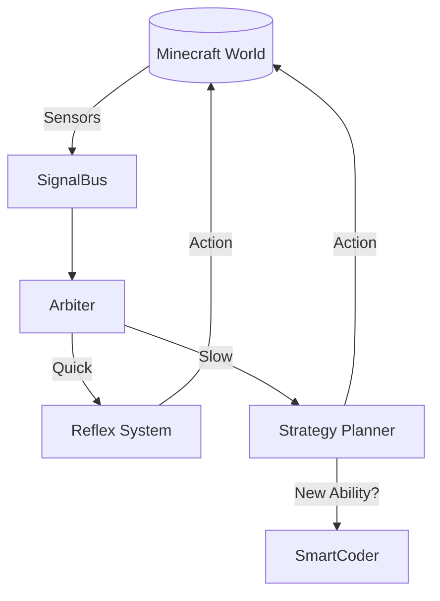

# 🧠 PROJECT CONTEXT: MINDCRAFT AI (v2.2 Ironclad Cortex)

> **LƯU Ý:** Đây là tài liệu sống (living document). AI Assistant bắt buộc phải đọc file này đầu tiên để hiểu ngữ cảnh.

---

## 🎯 MỤC TIÊU CỐT LÕI (Core Goals)
Chúng ta đang xây dựng một **Thực Thể Số (Digital Entity)** trong Minecraft, không phải một bot script thông thường.
1. **Khả năng Tự Chủ (Autonomy):** Bot tự ra quyết định, không cần user ra lệnh từng bước.
2. **Tư Duy Kép (Dual-Loop):** Kết hợp giữa **Phản Xạ Nhanh** (System 1) và **Suy Nghĩ Sâu** (System 2).
3. **Tiến Hóa (Evolution):** Bot có khả năng **tự viết code** để học kỹ năng mới thông qua `SmartCoder`.

---

## 🏗️ KIẾN TRÚC HỆ THỐNG (Architecture)

Quy trình xử lý thông tin đi theo luồng **Sự Kiện - Phản Ứng (Event-Driven)**:

1. **Cảm Nhận (Sense):** Bot nhận thông tin từ môi trường (block, entity, chat).
2. **Truyền Tin (SignalBus):** Dữ liệu được đẩy vào hệ thống trung tâm `SignalBus`.
3. **Phân Loại (Arbiter):** "Trọng tài" quyết định ai sẽ xử lý:
   - *Nguy hiểm / Gấp:* Giao cho **Reflex System** (Phản ứng tức thì).
   - *Phức tạp / Dài hạn:* Giao cho **Strategy Planner** (Lập kế hoạch).
4. **Hành Động (Act):** Thực thi qua `Skills` hoặc `Movement`.

---

## 📂 CẤU TRÚC CODEBASE (Project Structure)
Dưới đây là bản đồ giúp bạn tra cứu nhanh:

| Thư mục | Chức năng | Ghi chú quan trọng |
| :--- | :--- | :--- |
| **`src/agent/`** | **Bộ não trung tâm** | Chứa `Arbiter`, `Reflexes` (System 1), `core/`. |
| **`src/skills/`** | **Kỹ năng** | Nơi chứa các hành động (Mining, Crafting, Combat). Logic phức tạp nên ở đây. |
| **`src/brain/`** | **Bộ nhớ & Tư duy** | Quản lý ký ức và kết nối LLM. |
| **`src/profiles/`** | **Tính cách** | File JSON cấu hình tính cách và prompt của bot. |
| **`src/models/`** | **Model Wrappers** | Code kết nối tới Groq, OpenAI, Qwen, etc. |

---

## 📜 4 QUY TẮC VÀNG (Golden Rules)
*Tuân thủ tuyệt đối khi viết code:*

1.  **⚡ Signal First:** Không gọi hàm trực tiếp giữa các module ngang hàng. Hãy bắn sự kiện qua `SignalBus`.
2.  **🛡️ Sandbox Safety:** Code do AI tự viết (Self-writing code) BẮT BUỘC phải chạy trong Sandbox/VM để tránh crash bot.
3.  **🧱 Skill Modules:** Đừng viết logic phức tạp thẳng vào `bot.js` hay `main.js`. Hãy tách nó thành một Skill trong `src/skills/library/`.
4.  **🔄 Fail Gracefully:** Luôn luôn `try-catch`. Nếu một hành động thất bại, Bot phải biết thử lại hoặc bỏ qua, không được sập nguồn.

---
*Last Updated: Feb 2026 | Version: 2.2 Ironclad Cortex*
