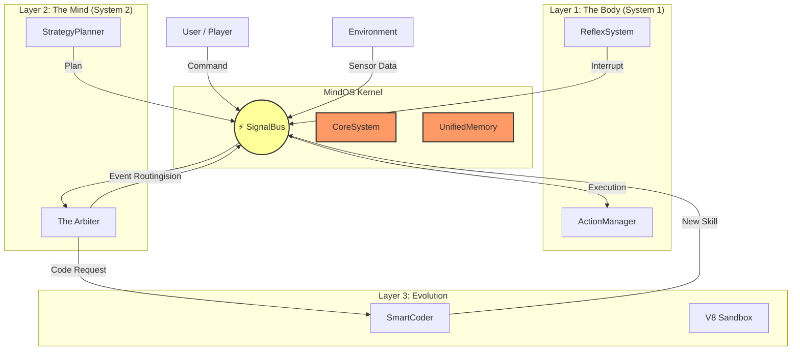

<div align="center">

# 🧠 MindOS V2.5 (Sovereign Swarm)
### The First Event-Driven, Self-Evolving AI Kernel for Minecraft
### Hệ Điều Hành AI Hướng Sự Kiện & Tự Tiến Hóa Đầu Tiên Cho Minecraft

[](https://opensource.org/licenses/MIT)
[]()
[](https://github.com/your-repo/mindcraft)
[]()

</div>

---

> [!WARNING]
> **ARCHITECTURAL ALERT (2026-02-11):** A Strategic Audit has identified critical performance bottlenecks in the current Event-Loop handling and memory management. We are transitioning to an **isolated-vm** sandbox and **Adaptive Context** processing. 
> See [**Strategic Audit Report**](./docs/reports/strategic_audit_20260211.md) for details.

---

## 📖 Introduction / Giới Thiệu

**MindOS** is not just a Minecraft bot; it is a **Generalized AI Operating System** designed to mimic the cognitive architecture of a biological organism. Unlike traditional linear scripts, MindOS features a **Dual-Loop Nervous System** that allows it to "think fast" (reflexes) and "think slow" (planning) simultaneously, enabling true autonomy.
**MindOS** không chỉ là một bot Minecraft; nó là một **Hệ Điều Hành AI Tổng Quát** được thiết kế để mô phỏng kiến trúc nhận thức của sinh vật sống. Khác với các kịch bản tuyến tính truyền thống, MindOS sở hữu **Hệ Thần Kinh Vòng Lặp Kép** cho phép nó "tư duy nhanh" (phản xạ) và "tư duy chậm" (lập kế hoạch) cùng lúc, mang lại khả năng tự chủ thực sự.

### The Philosophy / Triết Lý
> "Code that writes itself is the only code that survives context shifts."
> "Mã nguồn tự viết là mã nguồn duy nhất tồn tại qua sự thay đổi ngữ cảnh."

We built MindOS to solve the **"Context Collapse"** problem in AI agents. By decoupling the **Brain (Planner)** from the **Body (Executor)** via a **SignalBus**, the agent can adapt to any situation without crashing its core logic.
Chúng tôi xây dựng MindOS để giải quyết vấn đề **"Sụp Đổ Ngữ Cảnh"** trong các tác nhân AI. Bằng cách tách biệt **Bộ Não (Planner)** khỏi **Cơ Thể (Executor)** thông qua **SignalBus**, tác nhân có thể thích nghi với mọi tình huống mà không làm hỏng logic cốt lõi.

---

## 🚀 Enterprise Features / Tính Năng Doanh Nghiệp

### 1. ⚔️ Warrior Reflexes (v2.5) / Phản Xạ Chiến Binh
- **High-Precision Combat:** Tick-perfect W-Tap resets, predictive Crystal Aura, and Gaussian distributed delays to bypass anti-cheat.
- **Hit Selection:** Lag-compensated attacks using historical position tracking (backtracking).

### 2. 🧬 Adversarial Learning / Học Tập Đối Kháng
- **Tick-Perfect Replay Buffer:** Captures the last 30s of activity at 50ms resolution. Freezes and exports on death for analysis.
- **Self-Refactoring Loop:** LLM analyzes death replays and automatically rewrites skill code to avoid future failures.

### 3. 🐝 Sovereign Swarm / Bầy Đàn Tối Cao
- **P2P Coordination (Sigma Protocol):** Multiple agents share targets, status, and roles (TANK, DPS, RETREATER) via a P2P mesh over whispers.
- **Flocking Movement:** Coordinated formations using repulsion/cohesion vectors to prevent collisions and maximize area control.

### 4. ⚡ Async Infrastructure / Hạ Tầng Bất Đồng Bộ
- **Pathfinding Workers:** Offloads heavy A* calculations to separate threads, ensuring 100% main-loop responsiveness.
- **Secure Sandbox:** AI-generated code runs in a sandboxed environment with strict DoS protection.

---

## 🛠️ System Architecture / Kiến Trúc Hệ Thống

The MindOS Kernel is composed of 4 distinct layers working in harmony:
MindOS Kernel bao gồm 4 tầng riêng biệt hoạt động hài hòa:



---

## ⚡ Quick Start / Bắt Đầu Nhanh

### Prerequisites / Yêu Cầu
- **Runtime:** Node.js v18+ (LTS Recommended)
- **Game:** Minecraft Java Edition (v1.20.4 or compatible)
- **API Key:** One valid key (OpenAI, Gemini, Anthropic, or Local LLM)

### Installation / Cài Đặt

1.  **Clone Repository:**
    ```bash
    git clone https://github.com/your-repo/mindcraft.git
    cd mindcraft
    ```

2.  **Install Dependencies:**
    ```bash
    npm install
    # If using Vision (Canvas), ensure python/build tools are installed
    ```

3.  **Configure Environment (New!):**
    We now use `.env` for security.
    ```bash
    # Copy example file
    cp .env.example .env
    
    # Edit .env with your keys
    # OPENAI_API_KEY=sk-proj-...
    ```

### Running / Chạy

*   **Standard Mode:**
    ```bash
    node main.js --profile ./profiles/andy.json
    ```

*   **Interactive Menu (Recommended):**
    ```bash
    npm start
    # Select Option 1 (Run) or Option 4 (Debug)
    ```

---

## 📚 Documentation Suite / Bộ Tài Liệu

We provide comprehensive documentation for developers and researchers:
Chúng tôi cung cấp tài liệu toàn diện cho nhà phát triển và nhà nghiên cứu:

| Document | Description | Mô Tả |
|----------|-------------|-------|
| [**SYSTEM_ARCHITECTURE.md**](./docs/architecture/SYSTEM_ARCHITECTURE.md) | Deep dive into the Kernel, SignalBus, and Arbiter. | Đi sâu vào Kernel, SignalBus và Arbiter. |
| [**DEVELOPER_GUIDE.md**](./docs/DEVELOPER_GUIDE.md) | How to write Skills, contribute code, and debug. | Cách viết Skill, đóng góp code và gỡ lỗi. |
| [**SELF_EVOLUTION.md**](./docs/SELF_EVOLUTION.md) | Theory and practice of the SmartCoder engine. | Lý thuyết và thực hành của động cơ SmartCoder. |
| [**FAQ.md**](./FAQ.md) | Troubleshooting common errors (Ports, Mods). | Khắc phục lỗi thường gặp (Cổng, Mod). |
| [**TEST_PLAN.md**](./docs/TEST_PLAN.md) | QA protocols and integration tests. | Quy trình QA và kiểm thử tích hợp. |

---

## 🤝 Contributing / Đóng Góp

We welcome contributions! Please see the `DEVELOPER_GUIDE.md` for our coding standards.
Chúng tôi hoan nghênh mọi đóng góp! Vui lòng xem `DEVELOPER_GUIDE.md` để biết tiêu chuẩn code.

- **Issues:** Report bugs via GitHub Issues.
- **Pull Requests:** Submit PRs to the `develop` branch.

---

<div align="center">
    <b>Built with ❤️ by the Antigravity Team</b><br>
    <i>"Intelligence is the ability to adapt to change." - Stephen Hawking</i>
</div>