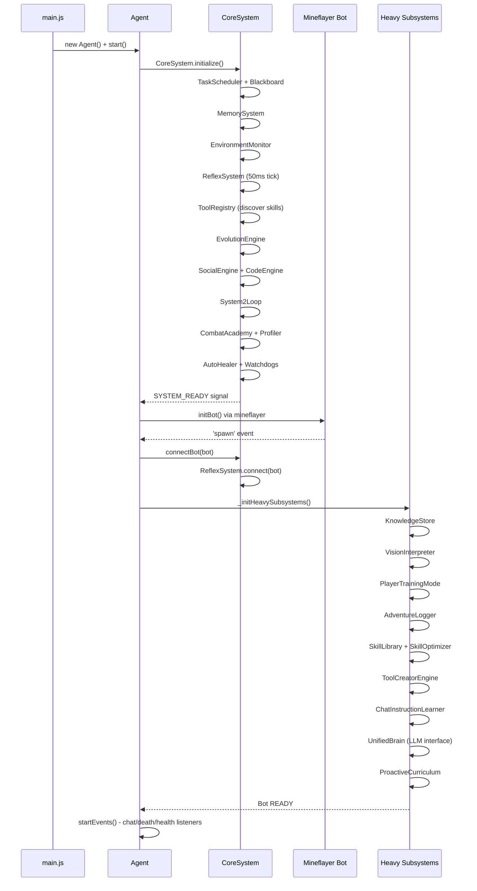
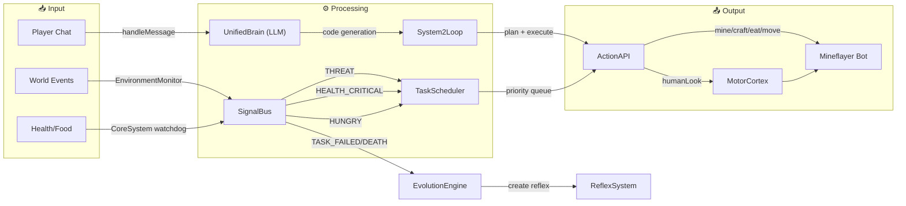
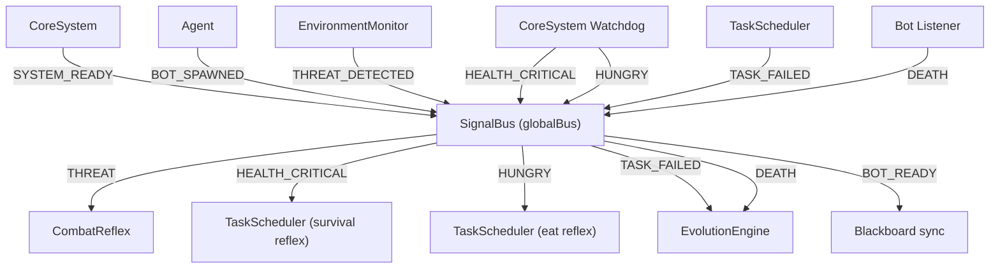

# Sơ Đồ Tư Duy — Minecraft AI Bot (Full System)

## Kiến Trúc Tổng Thể

```mermaid
graph TB
    subgraph Entry["🚀 Entry"]
        Main["main.js"]
        Settings["settings.js"]
    end

    subgraph Agent["🤖 Agent (agent.js - 2000 lines)"]
        A_Init["start()"]
        A_Connect["_connectToMinecraft()"]
        A_Heavy["_initHeavySubsystems()"]
        A_Events["startEvents()"]
        A_Handle["handleMessage()"]
    end

    subgraph Kernel["🧠 Kernel (CoreSystem.js)"]
        CS["CoreSystem.initialize()"]
        TS["TaskScheduler"]
        BB["Blackboard"]
        SB["SignalBus"]
    end

    subgraph Memory["💾 Memory"]
        MS["MemorySystem"]
        VS["VectorStore"]
        Chat["ChatHistory"]
        KS["KnowledgeStore"]
    end

    subgraph Brain["🧩 Intelligence"]
        UB["UnifiedBrain (34KB)"]
        CE["CodeEngine"]
        CSBox["CodeSandbox (isolated-vm)"]
        SM["SkillManager"]
        SO["SkillOptimizer"]
        TC["ToolCreatorEngine"]
        CIL["ChatInstructionLearner"]
        UE["UtilityEngine"]
    end

    subgraph Perception["👁 Perception"]
        EM["EnvironmentMonitor"]
        PM["PerceptionManager"]
        VSched["VisionScheduler"]
        VI["VisionInterpreter"]
    end

    subgraph Actions["⚡ Action Layer"]
        AA["ActionAPI (49 methods)"]
        AM["ActionManager"]
        MC["MotorCortex"]
        TR["ToolRegistry"]
    end

    subgraph Reflexes["⚔ Reflexes (System 1)"]
        RS["ReflexSystem (50ms tick)"]
        CR["CombatReflex"]
        SP["SelfPreservation"]
        SR["StuckReflex"]
        FD["FallDamageReflex"]
        WD["Watchdog"]
        HS["HitSelector"]
        PP["PhysicsPredictor"]
        DR["DeathRecovery"]
    end

    subgraph Skills["🛠 Skills Library (24 files)"]
        GW["gather_wood"]
        CI["craft_items"]
        SI["smelt_items"]
        MO["mine_ores"]
        GR["gather_resources"]
        FS["find_shelter"]
        EF["eat_food"]
        CS2["combat_skills"]
        GT["go_to"]
        FP["follow_player"]
        PB["place_blocks"]
    end

    subgraph Evolution["🧬 Evolution"]
        EE["EvolutionEngine"]
        GE["GeneEngine"]
        PC["ProactiveCurriculum"]
        RCE["ReflexCreatorEngine"]
        DynR["DynamicReflex"]
        RB["ReplayBuffer"]
    end

    subgraph Social["👥 Social"]
        SE["SocialEngine"]
        SPro["SocialProfile"]
        Arb["Arbiter"]
        PTM["PlayerTrainingMode"]
        CA["CombatAcademy"]
    end

    subgraph Orchestration["📋 Orchestration (System 2)"]
        S2["System2Loop"]
        Plan["PlannerAgent"]
        Exec["ExecutorAgent"]
        Crit["CriticAgent"]
    end

    subgraph Extra["📦 Extras"]
        AL["AdventureLogger"]
        Prof["Profiler"]
        CExt["CoreExtractor"]
        SS["SwarmSync"]
        AH["AutoHealer"]
        HM["HealthMonitor"]
        Wiki["MinecraftWiki"]
    end

    Main --> Agent
    Settings --> Agent
    A_Init --> CS
    CS --> TS & SB & MS & EM & RS & TR & EE & SE & CE & S2 & CA & BB
    A_Connect -->|mineflayer| A_Events
    A_Heavy --> KS & VI & PTM & AL & UB & CIL & SO & TC
    A_Handle --> UB --> CE --> CSBox

    TS --> BB
    SB -->|signals| Reflexes
    SB -->|TASK_FAILED| EE
    SB -->|DEATH| EE

    CE --> Skills
    Skills --> AA --> MC
    AA --> AM

    EE --> RCE --> DynR
    EE --> RB
    PC --> A_Handle

    RS --> CR & SP & SR & FD & WD & HS & PP & DR

    S2 --> Plan & Exec & Crit

    SE --> SPro
```

---

## Boot Sequence (Thứ tự khởi động)

```mermaid
sequenceDiagram
    participant M as main.js
    participant A as Agent
    participant CS as CoreSystem
    participant Bot as Mineflayer Bot
    participant H as Heavy Subsystems

    M->>A: new Agent() + start()
    A->>CS: CoreSystem.initialize()
    CS->>CS: TaskScheduler + Blackboard
    CS->>CS: MemorySystem
    CS->>CS: EnvironmentMonitor
    CS->>CS: ReflexSystem (50ms tick)
    CS->>CS: ToolRegistry (discover skills)
    CS->>CS: EvolutionEngine
    CS->>CS: SocialEngine + CodeEngine
    CS->>CS: System2Loop
    CS->>CS: CombatAcademy + Profiler
    CS->>CS: AutoHealer + Watchdogs
    CS-->>A: SYSTEM_READY signal

    A->>Bot: initBot() via mineflayer
    Bot-->>A: 'spawn' event
    A->>CS: connectBot(bot)
    CS->>CS: ReflexSystem.connect(bot)

    A->>H: _initHeavySubsystems()
    H->>H: KnowledgeStore
    H->>H: VisionInterpreter
    H->>H: PlayerTrainingMode
    H->>H: AdventureLogger
    H->>H: SkillLibrary + SkillOptimizer
    H->>H: ToolCreatorEngine
    H->>H: ChatInstructionLearner
    H->>H: UnifiedBrain (LLM interface)
    H->>H: ProactiveCurriculum
    H-->>A: Bot READY

    A->>A: startEvents() - chat/death/health listeners
```

---

## Data Flow (Luồng dữ liệu)

```mermaid
flowchart LR
    subgraph Input["📥 Input"]
        Chat["Player Chat"]
        World["World Events"]
        Health["Health/Food"]
    end

    subgraph Process["⚙ Processing"]
        SB["SignalBus"]
        UB["UnifiedBrain (LLM)"]
        TS["TaskScheduler"]
        S2["System2Loop"]
    end

    subgraph Output["📤 Output"]
        AA["ActionAPI"]
        Bot["Mineflayer Bot"]
        MC["MotorCortex"]
    end

    Chat -->|handleMessage| UB
    World -->|EnvironmentMonitor| SB
    Health -->|CoreSystem watchdog| SB

    SB -->|THREAT| TS -->|priority queue| AA
    SB -->|HEALTH_CRITICAL| TS
    SB -->|HUNGRY| TS

    UB -->|code generation| S2
    S2 -->|plan + execute| AA
    AA -->|mine/craft/eat/move| Bot
    AA -->|humanLook| MC --> Bot

    SB -->|TASK_FAILED/DEATH| EE["EvolutionEngine"]
    EE -->|create reflex| RS["ReflexSystem"]
```

---

## Signal Bus (Hệ thống tín hiệu)

```mermaid
flowchart TB
    SB["SignalBus (globalBus)"]

    CS["CoreSystem"] -->|SYSTEM_READY| SB
    Agent["Agent"] -->|BOT_SPAWNED| SB
    EM["EnvironmentMonitor"] -->|THREAT_DETECTED| SB
    CW["CoreSystem Watchdog"] -->|HEALTH_CRITICAL| SB
    CW -->|HUNGRY| SB
    TS["TaskScheduler"] -->|TASK_FAILED| SB
    Bot["Bot Listener"] -->|DEATH| SB

    SB -->|THREAT| CR["CombatReflex"]
    SB -->|HEALTH_CRITICAL| TSR["TaskScheduler (survival reflex)"]
    SB -->|HUNGRY| TSE["TaskScheduler (eat reflex)"]
    SB -->|TASK_FAILED| EE["EvolutionEngine"]
    SB -->|DEATH| EE
    SB -->|BOT_READY| BB["Blackboard sync"]
```

---

