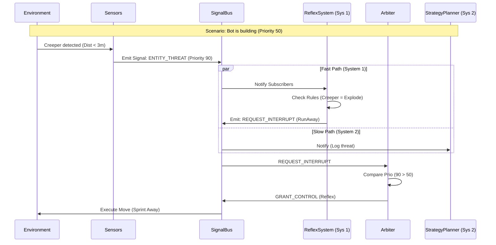
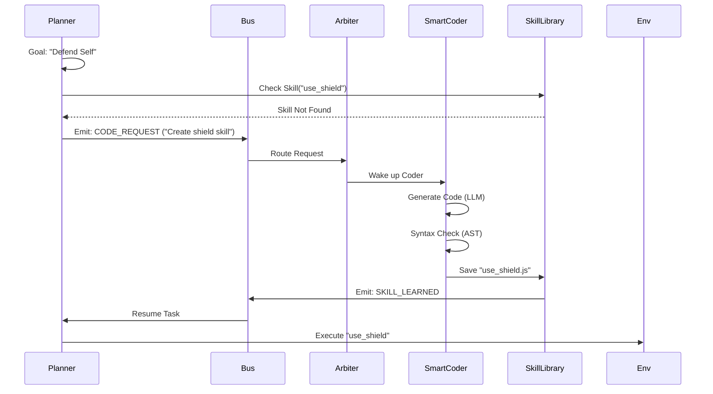

# 🏗️ MindOS System Architecture (Technical Bible)
## Kiến Trúc Hệ Thống MindOS (Tài Liệu Kỹ Thuật)

> **Version:** 1.0 (Evolution Edition)
> **Architecture Pattern:** Event-Driven, Dual-Loop Cognitive System (Kiến trúc Nhận thức Vòng lặp Kép Hướng Sự kiện)

---

## 1. High-Level Overview / Tổng Quan

MindOS breaks away from the monolithic "while-loop" bot design. Instead, it operates as a distributed system of independent modules communicating via a central **Nervous System (SignalBus)**. This allows the bot to handle high-frequency events (combat) without blocking low-frequency reasoning (planning).

MindOS phá vỡ thiết kế bot "vòng lặp while" nguyên khối. Thay vào đó, nó hoạt động như một hệ thống phân tán gồm các module độc lập giao tiếp qua **Hệ Thần Kinh Trung Ương (SignalBus)**. Điều này cho phép bot xử lý các sự kiện tần suất cao (chiến đấu) mà không chặn suy luận tần suất thấp (lập kế hoạch).

### The Four Layers of MindOS / Bốn Tầng Của MindOS

1.  **Layer 1: The Nervous System (Kernel):** `SignalBus`, `TaskScheduler`. The communication backbone.
2.  **Layer 2: The Body (System 1):** `ReflexSystem`, `ActionManager`. Millisecond reactions.
3.  **Layer 3: The Mind (System 2):** `StrategyPlanner`, `Arbiter`, `Dreamer` (Memory). Reasoning & Strategy.
4.  **Layer 4: The Evolution (Meta):** `SmartCoder`, `SkillLibrary`. Self-improvement & Code Generation.

---

## 2. Core Components / Thành Phần Cốt Lõi

### 2.1. The SignalBus (The Nervous System)
*Location: `src/agent/core/SignalBus.js`*

The **SignalBus** is the single source of truth for state changes. It replaces direct function calls between modules, preventing "Spaghetti Code".

*   **Pub/Sub Model:** Modules subscribe to specific signals (`HEALTH_LOW`, `CHAT_MESSAGE`).
*   **Event Priority:** Signals carry priority weights. A `SURVIVAL` signal interrupts a `WORK` task immediately.

**Key Signals:**
| Signal | Description | Priority |
|--------|-------------|----------|
| `HEALTH_CRITICAL` | HP < 50%, triggers extensive defense protocols | 100 (Max) |
| `ENTITY_ATTACK` | Immediate threat detected | 90 |
| `USER_COMMAND` | Direct instruction from admin | 80 |
| `CODE_REQUEST` | Mind needs new capability | 50 |
| `IDLE_TICK` | No active tasks, perform maintenance | 10 |

### 2.2. The Arbiter (The Decision Maker)
*Location: `src/agent/Arbiter.js`*

The **Arbiter** acts as the Traffic Controller. It receives signals and decides *who* handles them. It prevents the "Split Brain" problem where the Reflex System and Planner try to control the body simultaneously.

*   **Role:** Resolves conflicts between System 1 (Fast) and System 2 (Slow).
*   **Logic:**
    *   If `Signal.Priority > CurrentTask.Priority` → **Interrupt & Switch**.
    *   If `Signal.Priority <= CurrentTask.Priority` → **Queue or Ignore**.

### 2.3. Unified Memory (The Knowledge Graph)
*Location: `src/agent/memory/UnifiedMemory.js` & `Dreamer.js`*

Modern Agents require more than just a vector database. MindOS implements **Unified Memory**:

1.  **Short-Term (RAM):** Immediate context (last 20 messages, current inventory).
2.  **Long-Term (Vector):** Embedding search for past conversations/instructions.
3.  **Graph (Cognee/Future):** Structured relationships (e.g., "Home is at X,Y,Z", "Iron is needed for Pickaxe").

---

## 3. Data Flow Diagrams / Biểu Đồ Luồng Dữ Liệu

### 3.1. The Stimulus-Response Loop (Vòng Lặp Kích Thích-Phản Hồi)

How the bot reacts to a Creeper appearing while building a house:

### 3.2. The Evolution Loop (Vòng Lặp Tiến Hóa)

How the bot learns to "Craft a Shield" when it doesn't know how:

---

## 4. Security & Safety / Bảo Mật & An Toàn

### 4.1. The Sandbox
All AI-generated code is executed in a restricted context using `vm2` or `compartments` (depending on configuration).
*   **Blocked:** `eval()`, `child_process`, `fs` (write access outside sandbox).
*   **Allowed:** `bot` API, `vec3`, `pathfinder`.

### 4.2. The Watchdog
A background heartbeat monitor that ensures the bot never hangs.
*   **Mechanism:** If a task takes > 60 seconds without reporting progress, the Watchdog emits `SYSTEM_RESET`.
*   **Recovery:** The Arbiter clears the task queue and respawns the default Idle state.

---

## 5. Developer Notes / Ghi Chú Phát Triển

*   **Adding Sensors:** Register new event listeners in `src/agent/reflexes/sensors/`.
*   **Modifying Priorities:** Edit `src/agent/core/TaskScheduler.js` constants.
*   **Debugging:** Run with `DEBUG=true` to see raw SignalBus traffic.
