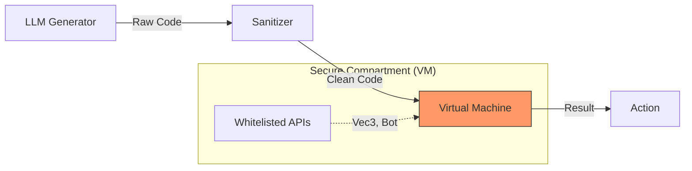

# Self-Evolution / Tự Tiến Hóa

## 🦠 The Evolution Loop / Vòng Lặp Tiến Hóa

MindOS is designed to improve itself over time. This is not just "learning" parameters; it is **structural self-modification**.
MindOS được thiết kế để tự cải thiện theo thời gian. Đây không chỉ là "học" tham số; nó là **tự sửa đổi cấu trúc**.

### The Cycle / Chu Trình

1.  **Failure Detection (Phát hiện Lỗi)**:
    - `TaskScheduler` marks a task as `FAILED` after N retries.
    - `ActionManager` catches a runtime error.
    
2.  **Snapshot & Context (Chụp Ảnh & Bối Cảnh)**:
    - The `EvolutionEngine` captures the current state (Inventory, Nearby blocks, Last logs).
    - It retrieves the code that caused the error.

3.  **LLM Analysis (Phân Tích LLM)**:
    - The `SmartCoder` sends the error + code to the LLM.
    - Prompt: "Why did this fail? Fix the code."

4.  **Sandbox Validation (Kiểm Tra Sandbox)**:
    - The new code is generated.
    - It is DRY-RUN inside a `Compartment` (VM) to check for syntax errors and malicious patterns.

5.  **Hot-Swap (Thay Nóng)**:
    - If valid, the new code replaces the old function in `SkillLibrary`.
    - The bot retries the task immediately with new capabilities.

---

## 🔒 The Sandbox Mechanism / Cơ Chế Sandbox

To prevent the AI from deleting system files or crashing the server, we use a **Compartment (Sesame/Lockdown)** approach.
Để ngăn AI xóa file hệ thống, chúng tôi dùng cách tiếp cận **Compartment**.



- **Whitelisted**: `bot`, `vec3`, `skills` (read-only).
- **Blacklisted**: `fs`, `child_process`, `eval`, `process`.

---

## 🧬 Example Generated Skill / Ví Dụ Skill Được Tạo

Here is a real example of a skill MindOS generated when it couldn't find a path to a tree:
Đây là ví dụ thực tế MindOS tạo ra khi không tìm được đường đến cây:

```javascript
// Generated Skill: bridge_to_target
// Reason: Previous pathfinding failed due to gap.
export async function main(bot) {
    const target = bot.findBlock({ matching: bot.registry.blocksByName.log.id });
    if (!target) return;
    
    // AI decided to place dirt blocks to bridge
    const gap = target.position.minus(bot.entity.position);
    if (gap.y == 0 && gap.x > 1) {
        await bot.equip(bot.registry.itemsByName.dirt.id, 'hand');
        await bot.placeBlock(bot.blockAt(bot.entity.position.offset(1, -1, 0)), new Vec3(0, 1, 0));
    }
}
```
