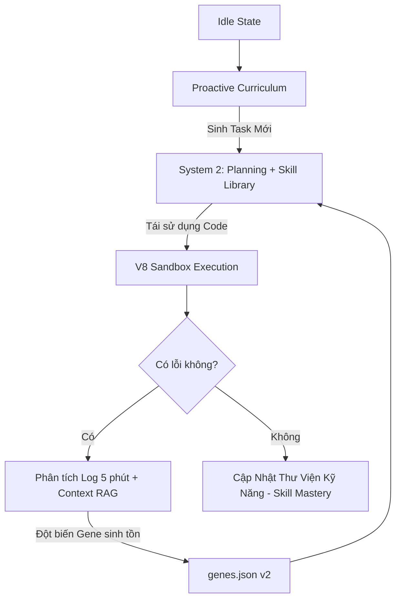

# PHASE 11: Evolutionary Artificial Intelligence (EAI) & Kiến Trúc Tự Trị

## 1. Mục tiêu Cốt lõi
Từ kết quả đối sánh nội bộ giữa Voyager và MindOS, hệ thống hiện tại đang chịu các rủi ro lớn từ "Context Collapse", "Đợi chết mới học" (Adversarial Learning), và "Nghẽn cổ chai SignalBus".
**Phase 11 (EAI)** sẽ là đợt đại tu mô hình tư duy, chuyển từ *Khắc phục Thụ động* sang **Chủ động Khám Phá (Proactive Curriculum)** giống Voyager, đồng thời kết hợp hệ Gene để tinh chỉnh phản xạ. 

## 2. Các Tính Năng Đề Xuất (Smart Proposal)

### 2.1. Automatic Curriculum Engine (Dựa trên Voyager)
Khắc phục điểm yếu "Đợi chết mới học":
- Bổ sung module `ProactiveCurriculum.js`: AI sẽ **tự động giao nhiện vụ** liên tục tịnh tiến (VD: Chặt gỗ -> Chế bàn -> Chế rìu) khi đang rảnh, thay vì trạng thái IDLE thụ động.
- Cho phép MindOS đặt ra **Mục tiêu Khám phá Dài hạn** và lưu vào "Long-term Planning Vector", khắc phục việc quên mất mục tiêu (Context Collapse).

### 2.2. Kế thừa Skill Library (Compositional Skills)
- Thay đổi cách Sandbox `SmartCoder` hoạt động: Việc tạo Action API không bị đập đi xây lại khi refactor lỗi. Các Code Snippet sẽ được lưu vào Cơ sở Dữ Liệu dưới dạng Module độc lập, tạo thành 1 **Skill Library có tính kế thừa**. Khi sang World mới, AI lôi thư viện ra xài ngay lập tức.

### 2.3. Genetic Parameter Matrix (Ma Trận Gene) cho System 1
Thay vì phụ thuộc hoàn toàn vào LLM chậm chạp (như Voyager bị yếu lúc Combat):
- Rút các thông số `CombatReflex` vào `genes.json` (khoảng cách né, delay rút khiên). 
- Đột biến Gene khi chết do sai số Combat. 

### 2.4. SignalBus Optimization & Async Throttle
Khắc phục ngay cảnh báo "Nút thắt cổ chai kiến trúc":
- Lên lịch giới hạn băng thông (Throttling) cho tín hiệu `world_update` và `vision`. 
- Ghi nhận `Tick-Perfect Replay Buffer` với băng thông thời gian thực tế dài hơn để LLM nhìn được Error Root-cause thay vì chỉ 30 giây cuối.

---

## 3. Kiến trúc Đề Xuất (MindOS EAI Roadmap)

## 4. Quyết định của người dùng
Phase 11 giờ sẽ là màn dung hợp điểm mạnh Sinh Tồn của MindOS (Event-driven Gene) và điểm mạnh Khám Phá/Học tập của Voyager (Curriculum + Skill Library).
Nếu anh đồng ý, chúng ta sẽ bắt tay vào cập nhật lại Phân đoạn Tasks chi tiết.
